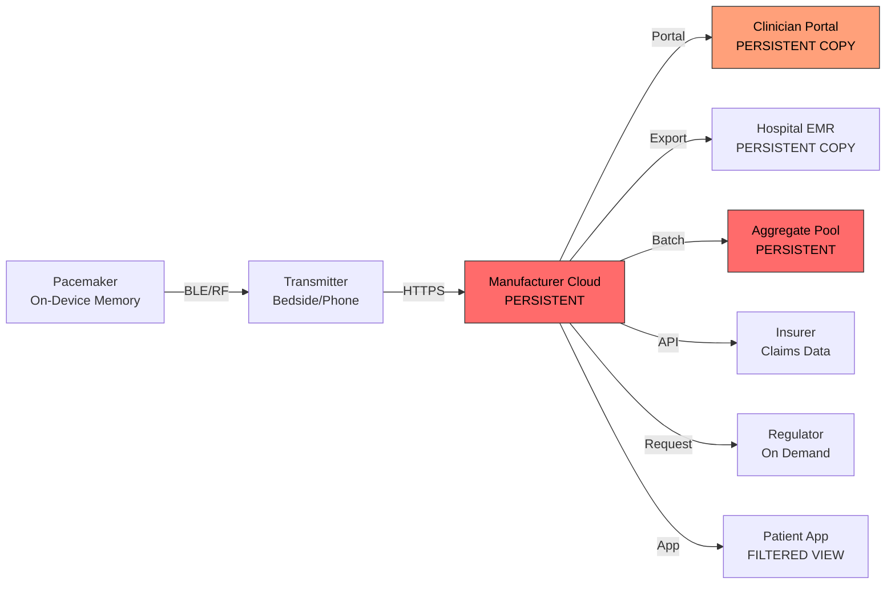
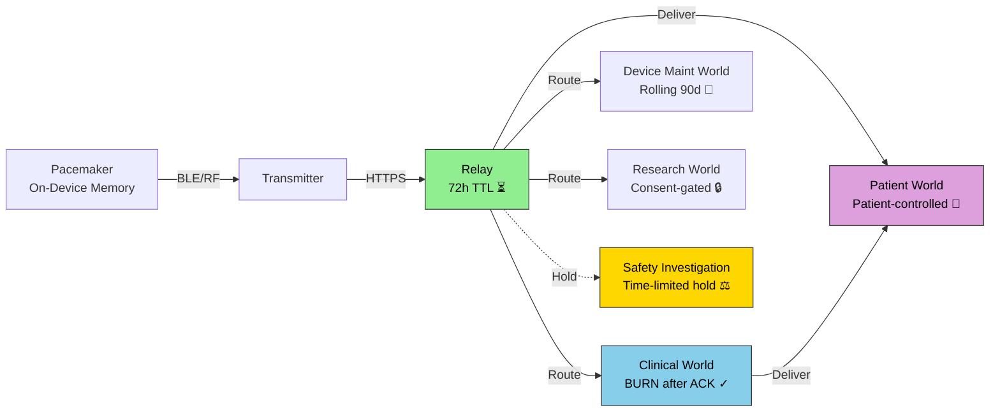

# Product Requirements Document
# Chamber Sentinel CIED Telemetry Simulator

**Version:** 1.0
**Date:** 2026-04-08
**Status:** Draft for Review
**Companion Document:** chamber_sentinel_medical_devices_v3.docx

---

## Table of Contents

1. [Executive Summary](#1-executive-summary)
2. [Problem Statement](#2-problem-statement)
3. [Goals & Non-Goals](#3-goals--non-goals)
4. [System Architecture Overview](#4-system-architecture-overview)
5. [Module 1: Synthetic EGM & Event Generator](#5-module-1-synthetic-egm--event-generator)
6. [Module 2: Current Architecture Simulation](#6-module-2-current-architecture-simulation)
7. [Module 3: Chambers Architecture Simulation](#7-module-3-chambers-architecture-simulation)
8. [Module 4: Comparative Analytics Engine](#8-module-4-comparative-analytics-engine)
9. [Module 5: Visualization & Reporting](#9-module-5-visualization--reporting)
10. [Data Models](#10-data-models)
11. [API Specifications](#11-api-specifications)
12. [Security & Privacy](#12-security--privacy)
13. [Testing Strategy](#13-testing-strategy)
14. [Deployment & Infrastructure](#14-deployment--infrastructure)
15. [Module 6: openCARP Integration — Biophysical EGM Fidelity](#15-module-6-opencarp-integration--biophysical-egm-fidelity)
16. [Success Metrics](#16-success-metrics)
17. [Appendices](#17-appendices)

---

## 1. Executive Summary

### 1.1 Purpose

This document specifies the requirements for a synthetic CIED (Cardiac Implantable Electronic Device) telemetry simulation platform that generates realistic cardiac event streams and maps data flows through two competing architectures:

1. **Current Architecture** — the manufacturer-intermediated, persist-by-default model used by Medtronic (CareLink), Boston Scientific (LATITUDE NXT), Abbott (Merlin.net), and Biotronik (Home Monitoring).
2. **Chambers Architecture** — the burn-by-default, sealed ephemeral processing model proposed in the Chamber Sentinel framework.

The simulator serves as an empirical testbed for the claims made in the Chamber Sentinel position paper (v3), enabling quantifiable comparison of data exposure windows, attack surface area, persistence volumes, and clinical data availability under both architectures.

### 1.2 Target Users

| User | Primary Use Case |
|------|-----------------|
| Security researchers | Quantify attack surface reduction under burn semantics |
| Clinical electrophysiologists | Validate that burn-by-default preserves clinical data availability |
| Regulatory analysts | Assess compliance posture of both architectures against GDPR/HIPAA/MDR |
| Privacy advocates | Demonstrate data sovereignty implications with concrete data flows |
| Device manufacturers | Evaluate feasibility of relay-without-retention architecture |
| Academic researchers | Publish reproducible analyses of CIED data persistence tradeoffs |

### 1.3 Scope

The simulator covers single-chamber (VVI), dual-chamber (DDD), and CRT-D (cardiac resynchronization therapy with defibrillator) pacemaker types. It does not simulate ICD-only devices, leadless pacemakers, or subcutaneous ICDs in v1, though the architecture must be extensible to these.

---

## 2. Problem Statement

### 2.1 The Gap

The Chamber Sentinel position paper (v3) makes architectural claims about burn-by-default semantics that are currently untestable:

- **Claim:** Burn semantics reduce attack surface. **Gap:** No quantified model of exposure window reduction.
- **Claim:** Clinical data availability is preserved under burn-by-default. **Gap:** No simulation of clinician acknowledgment latency vs. burn windows.
- **Claim:** Manufacturer relay-without-retention is architecturally plausible. **Gap:** No prototype demonstrating data processing without persistence.
- **Claim:** Safety investigation holds preserve accountability. **Gap:** No simulation of adverse event scenarios under burn semantics.
- **Claim:** Portable patient records can replace manufacturer cloud continuity. **Gap:** No prototype of the portable record format or delegation model.

### 2.2 What This Simulator Proves (and Does Not)

**Does prove:** That the data flow architecture described in the position paper can be implemented in software; that the tradeoffs between persistence and burn semantics can be quantified under synthetic but realistic conditions; that the typed-world model produces the access control boundaries claimed.

**Does not prove:** That the architecture is viable at production scale with real devices; that clinicians would accept the workflow changes; that regulatory bodies would approve the approach; that manufacturers could retrofit existing platforms. These require the empirical work identified in the position paper's Section 13.

---

## 3. Goals & Non-Goals

### 3.1 Goals

| ID | Goal | Success Criteria |
|----|------|-----------------|
| G-01 | Generate physiologically plausible synthetic CIED telemetry | Waveforms pass visual inspection by cardiologist; statistical properties match published IEGM datasets |
| G-02 | Model all 5 layers of the current CIED data ecosystem | Each layer maintains independent state; data persistence is observable and measurable at each layer |
| G-03 | Implement the 5 typed worlds of the Chambers architecture | Each world enforces access boundaries; burn schedules execute deterministically; data does not leak between worlds |
| G-04 | Quantify data exposure differential | Produce a time-series comparison of data volume persisted under both architectures for identical patient scenarios |
| G-05 | Simulate adverse event scenarios | Demonstrate Safety Investigation Hold mechanism; measure data loss under various burn-window configurations |
| G-06 | Simulate clinician acknowledgment latency | Model realistic review delays; identify burn-window thresholds that balance security and clinical availability |
| G-07 | Produce a portable patient record prototype | Demonstrate FHIR-based export of CIED data in patient-controlled format |
| G-08 | Visualize data flows in real time | Interactive dashboard showing data moving through both architectures simultaneously |
| G-09 | Generate reproducible comparison reports | PDF/HTML reports with quantified metrics for academic and regulatory audiences |
| G-10 | Support configurable patient cohorts | Simulate populations of 1–10,000 virtual patients with varied cardiac profiles |

### 3.2 Non-Goals

| ID | Non-Goal | Rationale |
|----|----------|-----------|
| NG-01 | Real device communication | No Bluetooth/RF protocols; simulator is software-only |
| NG-02 | Clinical-grade signal fidelity | Waveforms must be plausible, not FDA-approvable |
| NG-03 | Production security hardening | This is a research simulator, not a deployable medical system |
| NG-04 | Real patient data ingestion | Simulator uses only synthetic data; no PHI handling required |
| NG-05 | Manufacturer API integration | No connectivity to CareLink, LATITUDE, Merlin.net, or Home Monitoring |
| NG-06 | Real-time pacing control | No closed-loop therapy delivery simulation |

---

## 4. System Architecture Overview

### 4.1 High-Level Architecture

```
┌─────────────────────────────────────────────────────────────────────────┐
│                        SIMULATION ORCHESTRATOR                         │
│  ┌──────────────┐  ┌──────────────┐  ┌──────────────┐  ┌───────────┐  │
│  │   Patient     │  │   Scenario   │  │    Clock     │  │  Event    │  │
│  │   Cohort      │  │   Engine     │  │   Manager    │  │  Bus      │  │
│  │   Manager     │  │              │  │              │  │           │  │
│  └──────┬───────┘  └──────┬───────┘  └──────┬───────┘  └─────┬─────┘  │
│         │                 │                 │                 │        │
└─────────┼─────────────────┼─────────────────┼─────────────────┼────────┘
          │                 │                 │                 │
          ▼                 ▼                 ▼                 ▼
┌─────────────────────────────────────────────────────────────────────────┐
│                    MODULE 1: TELEMETRY GENERATOR                       │
│  ┌──────────────┐  ┌──────────────┐  ┌──────────────┐  ┌───────────┐  │
│  │   Cardiac     │  │   Device     │  │   Activity   │  │  Episode  │  │
│  │   Rhythm      │  │   Status     │  │   & Motion   │  │  & Alert  │  │
│  │   Engine      │  │   Engine     │  │   Engine     │  │  Engine   │  │
│  └──────┬───────┘  └──────┬───────┘  └──────┬───────┘  └─────┬─────┘  │
│         └──────────────────┴─────────────────┴───────────────┘        │
│                                    │                                   │
│                          ┌─────────▼─────────┐                        │
│                          │   Unified Event    │                        │
│                          │   Stream           │                        │
│                          └─────────┬─────────┘                        │
└────────────────────────────────────┼──────────────────────────────────┘
                                     │
                    ┌────────────────┼────────────────┐
                    ▼                                 ▼
┌──────────────────────────────┐  ┌──────────────────────────────────────┐
│  MODULE 2: CURRENT ARCH SIM  │  │  MODULE 3: CHAMBERS ARCH SIM        │
│                              │  │                                      │
│  ┌────────┐  ┌────────────┐  │  │  ┌────────────┐  ┌───────────────┐  │
│  │Layer 1 │  │ Layer 2    │  │  │  │ Clinical   │  │ Device Maint  │  │
│  │On-Dev  │→ │ Transmit   │  │  │  │ World      │  │ World         │  │
│  └────────┘  └─────┬──────┘  │  │  └────────────┘  └───────────────┘  │
│                    │         │  │  ┌────────────┐  ┌───────────────┐   │
│              ┌─────▼──────┐  │  │  │ Research   │  │ Patient       │   │
│              │ Layer 3    │  │  │  │ World      │  │ World         │   │
│              │ Cloud      │  │  │  └────────────┘  └───────────────┘   │
│              └─────┬──────┘  │  │  ┌────────────┐  ┌───────────────┐   │
│              ┌─────▼──────┐  │  │  │ Safety Inv │  │ Burn          │   │
│              │ Layer 4    │  │  │  │ World      │  │ Scheduler     │   │
│              │ Clinician  │  │  │  └────────────┘  └───────────────┘   │
│              └─────┬──────┘  │  │                                      │
│              ┌─────▼──────┐  │  │  ┌─────────────────────────────────┐ │
│              │ Layer 5    │  │  │  │ Relay (no-persist processor)    │ │
│              │ Aggregate  │  │  │  └─────────────────────────────────┘ │
│              └────────────┘  │  │                                      │
└──────────────────────────────┘  └──────────────────────────────────────┘
                    │                                 │
                    └────────────────┬────────────────┘
                                     ▼
┌─────────────────────────────────────────────────────────────────────────┐
│                    MODULE 4: COMPARATIVE ANALYTICS                     │
│  ┌──────────────┐  ┌──────────────┐  ┌──────────────┐  ┌───────────┐  │
│  │  Persistence  │  │  Attack      │  │  Clinical    │  │  Adverse  │  │
│  │  Volume       │  │  Surface     │  │  Availability│  │  Event    │  │
│  │  Tracker      │  │  Calculator  │  │  Monitor     │  │  Impact   │  │
│  └──────────────┘  └──────────────┘  └──────────────┘  └───────────┘  │
└─────────────────────────────────────────────────────────────────────────┘
                                     │
                                     ▼
┌─────────────────────────────────────────────────────────────────────────┐
│                    MODULE 5: VISUALIZATION & REPORTING                 │
│  ┌──────────────┐  ┌──────────────┐  ┌──────────────┐  ┌───────────┐  │
│  │  Real-time    │  │  Flow        │  │  Report      │  │  Export   │  │
│  │  Dashboard    │  │  Diagrams    │  │  Generator   │  │  Engine   │  │
│  └──────────────┘  └──────────────┘  └──────────────┘  └───────────┘  │
└─────────────────────────────────────────────────────────────────────────┘
```

### 4.2 Technology Stack

| Component | Technology | Rationale |
|-----------|-----------|-----------|
| Core simulation engine | Python 3.12+ | Scientific computing ecosystem; NumPy/SciPy for signal generation |
| Signal generation (synthetic) | NumPy, SciPy, neurokit2 | Established libraries for physiological signal synthesis |
| Signal generation (biophysical) | openCARP + CARPutils | Ionic-model-based IEGM generation; pre-computed waveform template library |
| Event streaming | Apache Kafka (or in-process queue for single-node) | Realistic event bus; decouples generator from consumers |
| Data storage (current arch sim) | PostgreSQL + TimescaleDB | Time-series optimised; models manufacturer cloud persistence |
| Data storage (Chambers arch sim) | Redis (TTL-based) + SQLite (portable record) | TTL keys model burn semantics; SQLite models patient-held store |
| Burn scheduler | Celery + Redis | Reliable scheduled task execution for burn events |
| API layer | FastAPI | Async, OpenAPI spec generation, type-safe |
| Visualization | Plotly Dash + D3.js | Interactive dashboards with real-time streaming |
| Flow diagrams | Mermaid.js + custom SVG renderer | Architectural flow visualization |
| Report generation | Jinja2 + WeasyPrint | PDF/HTML report output |
| Testing | pytest + Hypothesis (property-based) | Rigorous testing of signal properties and burn guarantees |
| Containerization | Docker + Docker Compose | Reproducible multi-service deployment |
| CI/CD | GitHub Actions | Automated testing and artifact generation |

### 4.3 Repository Structure

```
chamber-sentinel-cied-sim/
├── README.md
├── pyproject.toml
├── docker-compose.yml
├── Makefile
├── docs/
│   ├── architecture/
│   │   ├── current_arch_flow.mermaid
│   │   ├── chambers_arch_flow.mermaid
│   │   └── data_model_erd.mermaid
│   ├── api/
│   │   └── openapi.yaml
│   └── reports/
│       └── templates/
├── src/
│   ├── __init__.py
│   ├── config/
│   │   ├── __init__.py
│   │   ├── settings.py              # Pydantic settings management
│   │   ├── device_profiles.yaml     # Device type configurations
│   │   ├── patient_profiles.yaml    # Patient archetype definitions
│   │   └── scenario_definitions.yaml # Pre-built simulation scenarios
│   ├── generator/                    # MODULE 1
│   │   ├── __init__.py
│   │   ├── cardiac/
│   │   │   ├── __init__.py
│   │   │   ├── rhythm_engine.py     # Sinus, brady, tachy, AF, VT, VF
│   │   │   ├── egm_synthesizer.py   # Intracardiac electrogram generation
│   │   │   ├── conduction.py        # AV conduction modelling
│   │   │   ├── waveform_models.py   # P, QRS, T wave morphology
│   │   │   └── opencarp/
│   │   │       ├── __init__.py
│   │   │       ├── template_library.py   # Pre-computed openCARP waveform loader
│   │   │       ├── template_generator.py # Batch openCARP simulation runner
│   │   │       ├── ionic_adapter.py      # Adapter: openCARP output → EGM channel format
│   │   │       └── templates/            # .npy waveform template files (generated)
│   │   │           ├── nsr_atrial_50.npy
│   │   │           ├── nsr_ventricular_50.npy
│   │   │           ├── af_atrial_100.npy
│   │   │           ├── vt_ventricular_50.npy
│   │   │           └── ...               # ~20 rhythm × 50-100 beats each
│   │   ├── device/
│   │   │   ├── __init__.py
│   │   │   ├── pacing_engine.py     # Pacing decision logic (VVI/DDD/CRT)
│   │   │   ├── sensing_engine.py    # Sensing threshold simulation
│   │   │   ├── battery_model.py     # Battery depletion curves
│   │   │   ├── lead_model.py        # Lead impedance evolution
│   │   │   └── firmware_state.py    # Firmware version tracking
│   │   ├── patient/
│   │   │   ├── __init__.py
│   │   │   ├── activity_engine.py   # Accelerometer / daily activity
│   │   │   ├── circadian_model.py   # Day/night heart rate variation
│   │   │   └── comorbidity_model.py # Interaction effects (HF, diabetes)
│   │   ├── episodes/
│   │   │   ├── __init__.py
│   │   │   ├── arrhythmia_generator.py  # Stochastic arrhythmia events
│   │   │   ├── alert_generator.py       # Device alert conditions
│   │   │   └── adverse_event_gen.py     # Lead fracture, battery EOL, etc.
│   │   ├── stream.py                # Unified event stream assembly
│   │   └── cohort.py                # Multi-patient cohort management
│   ├── current_arch/                 # MODULE 2
│   │   ├── __init__.py
│   │   ├── layers/
│   │   │   ├── __init__.py
│   │   │   ├── on_device.py         # Layer 1: On-device storage
│   │   │   ├── transmitter.py       # Layer 2: BLE/RF to bedside
│   │   │   ├── cloud.py             # Layer 3: Manufacturer cloud
│   │   │   ├── clinician_portal.py  # Layer 4: Clinician access
│   │   │   └── aggregate_pool.py    # Layer 5: Population analytics
│   │   ├── persistence/
│   │   │   ├── __init__.py
│   │   │   ├── store.py             # TimescaleDB persistence layer
│   │   │   └── retention_policy.py  # Manufacturer retention rules
│   │   └── data_consumers/
│   │       ├── __init__.py
│   │       ├── oem.py               # Manufacturer consumer
│   │       ├── clinician.py         # Treating physician consumer
│   │       ├── hospital.py          # Hospital EMR consumer
│   │       ├── insurer.py           # Insurance consumer
│   │       └── regulator.py         # Regulatory consumer
│   ├── chambers_arch/                # MODULE 3
│   │   ├── __init__.py
│   │   ├── worlds/
│   │   │   ├── __init__.py
│   │   │   ├── base_world.py        # Abstract typed world
│   │   │   ├── clinical_world.py    # Full-fidelity clinical data
│   │   │   ├── device_maintenance_world.py  # Lead/battery/firmware
│   │   │   ├── research_world.py    # Consent-gated research data
│   │   │   ├── patient_world.py     # Patient-controlled portable record
│   │   │   └── safety_investigation_world.py  # Adverse event holds
│   │   ├── relay/
│   │   │   ├── __init__.py
│   │   │   ├── processor.py         # Stateless relay processor
│   │   │   ├── delivery_tracker.py  # Confirmed delivery tracking
│   │   │   └── ephemeral_store.py   # TTL-based temporary storage
│   │   ├── burn/
│   │   │   ├── __init__.py
│   │   │   ├── scheduler.py         # Burn schedule executor
│   │   │   ├── verifier.py          # Burn verification (cryptographic)
│   │   │   ├── policies.py          # Per-world burn policies
│   │   │   └── hold_manager.py      # Safety investigation hold logic
│   │   ├── portable_record/
│   │   │   ├── __init__.py
│   │   │   ├── fhir_exporter.py     # FHIR R4 export
│   │   │   ├── record_store.py      # Patient-side SQLite store
│   │   │   ├── delegation.py        # Family/caregiver delegation
│   │   │   └── emergency_access.py  # Emergency department access protocol
│   │   └── consent/
│   │       ├── __init__.py
│   │       ├── consent_manager.py   # Research consent tracking
│   │       └── election_manager.py  # Patient-elected persistence
│   ├── analytics/                    # MODULE 4
│   │   ├── __init__.py
│   │   ├── persistence_tracker.py   # Volume of data persisted over time
│   │   ├── attack_surface.py        # Attack surface area calculation
│   │   ├── clinical_availability.py # Clinical data availability scoring
│   │   ├── adverse_event_impact.py  # Data loss under adverse events
│   │   ├── regulatory_compliance.py # GDPR/HIPAA/MDR compliance scoring
│   │   └── comparator.py           # Side-by-side architecture comparison
│   ├── visualization/                # MODULE 5
│   │   ├── __init__.py
│   │   ├── dashboard/
│   │   │   ├── __init__.py
│   │   │   ├── app.py              # Dash application
│   │   │   ├── layouts/
│   │   │   │   ├── overview.py     # System overview layout
│   │   │   │   ├── flow_view.py    # Data flow visualization
│   │   │   │   ├── comparison.py   # Side-by-side comparison
│   │   │   │   ├── patient_view.py # Individual patient deep-dive
│   │   │   │   └── scenario.py     # Scenario runner interface
│   │   │   └── components/
│   │   │       ├── egm_trace.py    # Real-time EGM waveform display
│   │   │       ├── flow_sankey.py  # Sankey diagram of data flows
│   │   │       ├── burn_timeline.py # Burn event timeline
│   │   │       └── metrics_cards.py # KPI metric cards
│   │   ├── flow_diagrams/
│   │   │   ├── __init__.py
│   │   │   ├── renderer.py        # SVG flow diagram renderer
│   │   │   └── templates/
│   │   └── reports/
│   │       ├── __init__.py
│   │       ├── generator.py       # Report generation engine
│   │       └── templates/
│   └── api/
│       ├── __init__.py
│       ├── main.py                # FastAPI application
│       ├── routes/
│       │   ├── simulation.py      # Simulation control endpoints
│       │   ├── patients.py        # Patient cohort endpoints
│       │   ├── telemetry.py       # Telemetry stream endpoints
│       │   ├── analytics.py       # Analytics query endpoints
│       │   └── scenarios.py       # Scenario management endpoints
│       └── websockets/
│           └── stream.py          # Real-time telemetry WebSocket
├── tests/
│   ├── unit/
│   │   ├── test_rhythm_engine.py
│   │   ├── test_egm_synthesizer.py
│   │   ├── test_pacing_engine.py
│   │   ├── test_burn_scheduler.py
│   │   ├── test_worlds.py
│   │   ├── test_portable_record.py
│   │   └── test_analytics.py
│   ├── integration/
│   │   ├── test_current_arch_flow.py
│   │   ├── test_chambers_arch_flow.py
│   │   ├── test_adverse_event_scenario.py
│   │   └── test_comparison_pipeline.py
│   ├── property/
│   │   ├── test_signal_properties.py
│   │   ├── test_burn_guarantees.py
│   │   └── test_world_isolation.py
│   └── fixtures/
│       ├── sample_patients.json
│       ├── sample_scenarios.json
│       └── reference_egms/
├── scenarios/
│   ├── baseline_single_patient.yaml
│   ├── af_detection_and_alert.yaml
│   ├── lead_fracture_adverse_event.yaml
│   ├── battery_eol_transition.yaml
│   ├── clinician_latency_stress.yaml
│   ├── provider_transition.yaml
│   ├── population_1000_mixed.yaml
│   ├── law_enforcement_access.yaml
│   └── cybersecurity_breach.yaml
└── scripts/
    ├── seed_database.py
    ├── run_comparison.py
    ├── generate_report.py
    └── demo.py
```

---

## 5. Module 1: Synthetic EGM & Event Generator

### 5.1 Cardiac Rhythm Engine

#### 5.1.1 Supported Rhythms

| Rhythm | HR Range (bpm) | Regularity | Clinical Significance |
|--------|----------------|------------|----------------------|
| Normal Sinus Rhythm (NSR) | 60–100 | Regular | Baseline healthy rhythm |
| Sinus Bradycardia | 30–59 | Regular | Primary pacing indication |
| Sinus Tachycardia | 101–150 | Regular | Rate response, exercise, fever |
| Atrial Fibrillation (AF) | 80–180 (ventricular) | Irregularly irregular | Most common arrhythmia; key detection target |
| Atrial Flutter | 130–170 (ventricular) | Regular/variable | 2:1, 3:1, 4:1 conduction patterns |
| Supraventricular Tachycardia (SVT) | 150–250 | Regular | Narrow complex tachycardia |
| Ventricular Tachycardia (VT) | 120–250 | Regular or polymorphic | Life-threatening; requires ICD therapy |
| Ventricular Fibrillation (VF) | N/A (chaotic) | Completely irregular | Immediately life-threatening |
| Complete Heart Block (CHB) | 20–45 (escape) | Regular (P and QRS dissociated) | Mandatory pacing indication |
| Second-Degree AV Block (Mobitz I) | 50–100 | Progressive PR prolongation | May require pacing |
| Second-Degree AV Block (Mobitz II) | 40–80 | Intermittent dropped QRS | High-risk; typically requires pacing |
| Premature Ventricular Complexes (PVCs) | Underlying rate | Irregular | Isolated, couplets, bigeminy, trigeminy |
| Premature Atrial Complexes (PACs) | Underlying rate | Irregular | Common; usually benign |
| Junctional Rhythm | 40–60 | Regular | Narrow complex escape |
| Paced Rhythm (AAI) | Programmed rate | Regular | Atrial pacing only |
| Paced Rhythm (VVI) | Programmed rate | Regular | Ventricular pacing only |
| Paced Rhythm (DDD) | Programmed rate | Regular | Dual-chamber sequential pacing |
| Paced Rhythm (CRT) | Programmed rate | Regular | Biventricular pacing |

#### 5.1.2 Rhythm Transition Model

Rhythms are not static. The engine models transitions between rhythms using a Markov chain with clinically plausible transition probabilities:

```
State Machine (simplified):

NSR ──(p=0.001/hr)──→ AF
NSR ──(p=0.0005/hr)──→ SVT
NSR ──(p=0.0001/hr)──→ VT
AF  ──(p=0.01/hr)────→ NSR  (spontaneous conversion)
AF  ──(p=0.0002/hr)──→ VT   (degeneration)
VT  ──(p=0.1/hr)─────→ VF   (degeneration)
VT  ──(p=0.3/hr)─────→ NSR  (spontaneous termination or ATP)
VF  ──(p=0.0/hr)─────→ NSR  (requires shock; modelled as device intervention)
```

Transition probabilities are configurable per patient profile and are modulated by:
- Time of day (circadian variation)
- Activity level (exercise-induced arrhythmias)
- Comorbidities (heart failure increases AF/VT probability)
- Medication effects (antiarrhythmic suppression)
- Device programming (rate response, ATP thresholds)

#### 5.1.3 EGM Signal Synthesis

The EGM synthesizer supports two generation modes, selectable per simulation run:

**Mode A — Parametric Gaussian Synthesis (default, built-in):**
Fast, lightweight, suitable for architecture comparison and data-flow testing. Waveforms are plausible but not biophysically grounded. Used for population-scale simulations where throughput matters more than signal fidelity.

**Mode B — openCARP Biophysical Templates (optional, requires openCARP):**
Pre-computed waveform templates generated by openCARP's ionic models. Morphologically accurate because they originate from actual ion channel simulations (ten Tusscher, O'Hara-Rudy, or Courtemanche models). Used when the simulation must produce EGMs that pass expert electrophysiologist review or when validating signal-processing algorithms. See Section 15 for full integration specification.

The electrogram (EGM) synthesizer generates intracardiac signals that differ from surface ECGs:

**Atrial EGM (A-EGM):**
- Near-field atrial electrogram from the atrial lead
- High-amplitude atrial deflection, low-amplitude far-field ventricular signal
- Sampling rate: 256 Hz (configurable 128–512 Hz)
- Amplitude: 1.0–5.0 mV (configurable)
- Noise floor: 0.05–0.2 mV Gaussian noise + 50/60 Hz interference model

**Ventricular EGM (V-EGM):**
- Near-field ventricular electrogram from the RV lead
- High-amplitude ventricular deflection, minimal atrial signal
- Sampling rate: 256 Hz
- Amplitude: 5.0–20.0 mV
- Noise floor: 0.1–0.5 mV

**Shock channel (far-field):**
- RV coil to can/SVC coil
- Broader view; captures both atrial and ventricular activity
- Used for morphology discrimination
- Sampling rate: 128 Hz
- Amplitude: 0.5–3.0 mV

**Signal Generation Pipeline:**
```
Mode A (Parametric):
  1. Generate ideal rhythm template (P, QRS, T Gaussian components)
  2. Apply conduction model (PR interval, QRS duration, QT)
  3. Add pacing artifacts where device intervenes
  4. Apply amplitude modulation (posture, respiration)
  5. Add physiological noise (myopotentials, EMI)
  6. Apply lead characteristics (impedance-dependent signal)
  7. Quantize to device ADC resolution (12-bit typical)
  8. Buffer into device memory in episode-triggered segments

Mode B (openCARP):
  1. Look up rhythm state in pre-computed openCARP template library
  2. Select beat morphology from template pool (with beat-to-beat variation)
  3. Apply conduction model timing (PR interval, AV delay)
  4. Add pacing artifacts where device intervenes
  5. Apply lead-specific channel transform (near-field / far-field gains)
  6. Add physiological noise (same as Mode A, steps 5-6)
  7. Quantize to device ADC resolution (12-bit typical)
  8. Buffer into device memory in episode-triggered segments
```

#### 5.1.4 Episode-Triggered Recording

Real pacemakers do not continuously stream full EGM data. They record EGM strips when triggered by events:

| Trigger | EGM Duration | Channels Recorded | Buffer |
|---------|-------------|-------------------|--------|
| Arrhythmia detection (AT/AF) | 10s pre + 20s post trigger | A-EGM + V-EGM | Up to 14 episodes |
| Arrhythmia detection (VT/VF) | 10s pre + 30s post trigger | V-EGM + Shock | Up to 24 episodes |
| Mode switch event | 5s pre + 15s post | A-EGM + V-EGM | Up to 10 episodes |
| Manually triggered (patient magnet) | 30s continuous | All channels | 1 episode (overwrites) |
| Scheduled (periodic) | 10s snapshot | A-EGM + V-EGM | Rolling buffer |

### 5.2 Device Status Engine

#### 5.2.1 Battery Model

Models the battery depletion curve of a typical lithium-iodine pacemaker battery:

```
Stages:
  BOL (Beginning of Life) → voltage: 2.8V, impedance: <1kΩ
  MOL (Middle of Life)    → voltage: 2.7V, impedance: 2-5kΩ  (years 2-7)
  ERI (Elective Replacement Indicator) → voltage: 2.6V, impedance: 10-15kΩ
  EOS (End of Service)    → voltage: 2.4V, impedance: >20kΩ

Depletion rate factors:
  - Base pacing current: 10-25 µA per pacing output
  - Pacing percentage (0-100%): linear multiplier
  - Output voltage setting: exponential impact
  - Rate response sensor current: ~5 µA when active
  - Telemetry session drain: ~50 µA during interrogation
  - Periodic self-test: ~30 µA
  - Capacitor reformation (ICD/CRT-D): significant periodic drain

Model: Exponential depletion curve with inflection at ERI
  V(t) = V_BOL - k₁ * ln(1 + k₂ * ∫I(τ)dτ)
  where I(τ) = f(pacing%, output_V, rate_response, telemetry_schedule)
```

Projected longevity: 7–12 years depending on programming and usage. The model produces realistic battery voltage trends that match published Medtronic/Boston Scientific longevity calculators.

#### 5.2.2 Lead Impedance Model

```
Normal lead impedance evolution:
  Implant (acute): 400-1200 Ω (high, due to tissue inflammation)
  1-3 months (maturation): drops to 300-800 Ω
  Chronic (>3 months): stable at 300-700 Ω with slow upward drift

Failure modes:
  Lead fracture:     sudden increase to >2000 Ω
  Insulation breach: gradual or sudden decrease to <200 Ω
  Connection issue:  intermittent spikes, high variance

  Lead fracture model:
    impedance(t) = baseline + noise +
      fracture_component(t - t_fracture) * sigmoid_ramp(sharpness)
    where fracture develops over hours to days

Measurement frequency: daily automatic + each transmission cycle
```

#### 5.2.3 Pacing Threshold Model

```
Capture threshold evolution:
  Implant: 0.5-1.5V at 0.4ms (acute threshold)
  2-4 weeks: peaks at 1.0-3.0V (inflammation peak)
  3 months: stabilizes at 0.5-1.5V (chronic threshold)
  Steroid-eluting leads: reduced peak, faster stabilization

  Factors affecting chronic threshold:
    - Metabolic changes (electrolyte imbalance): +0.2-0.5V
    - Medications (flecainide, propafenone): +0.3-1.0V
    - Tissue maturation: slow upward drift, ~0.01V/year
    - Lead dislodgement: sudden increase to >5V or loss of capture

  Auto-capture algorithm simulation:
    - Tests threshold periodically (Medtronic: q8h; BSC: q21h)
    - Adjusts output to threshold + safety margin (typically 2x)
    - Reports threshold trends in transmission data
```

### 5.3 Activity & Motion Engine

#### 5.3.1 Accelerometer Simulation

```
Activity states:
  Sleep:       0-10 counts/min, variance: low
  Resting:     10-30 counts/min, variance: low
  Light activity (walking): 30-80 counts/min, variance: moderate
  Moderate activity (stairs, chores): 80-150 counts/min, variance: moderate
  Vigorous activity (exercise): 150-300 counts/min, variance: high

Circadian pattern:
  0000-0600: Sleep (95% probability)
  0600-0800: Transition to resting/light activity
  0800-1200: Mixed activity (profile-dependent)
  1200-1300: Resting (lunch)
  1300-1700: Mixed activity
  1700-2000: Light to moderate activity
  2000-2300: Resting, trending toward sleep
  2300-0000: Sleep onset

Patient profile modifiers:
  - Heart failure: reduced peak activity, longer rest periods
  - Elderly: compressed activity window, lower peaks
  - Active: higher peaks, more exercise bouts
  - Post-surgical: severely reduced for weeks, gradual increase
```

#### 5.3.2 Rate Response Simulation

The device's rate response algorithm adjusts pacing rate based on activity:

```
Rate response algorithm (simplified DDDR):
  target_rate = lower_rate + (max_sensor_rate - lower_rate) *
                response_curve(activity_level, response_factor)

  response_curve: sigmoid with configurable slope (1-10 scale)
  reaction_time: 15-45 seconds (configurable)
  recovery_time: 2-8 minutes (configurable)
```

### 5.4 Episode & Alert Engine

#### 5.4.1 Arrhythmia Episode Generation

Stochastic episode generator with clinically realistic distributions:

```
Episode parameters:
  AF episodes:
    frequency: Poisson(λ = patient_AF_burden)  # 0-24 episodes/day
    duration:  LogNormal(µ = 4.5, σ = 1.2) minutes  # 30s to days
    ventricular rate: Normal(µ = 120, σ = 25) bpm

  VT episodes:
    frequency: Poisson(λ = patient_VT_risk * 0.01)  # rare
    duration:  Exponential(λ = 0.05) seconds  # most self-terminate
    rate: Uniform(120, 250) bpm
    monomorphic vs polymorphic: Bernoulli(p = 0.8) # 80% monomorphic

  PVC burden:
    total_PVCs_per_day: Poisson(λ = patient_PVC_burden * 1000)
    distribution: clustered (beta-binomial model)
    coupling_interval: Normal(µ = 420, σ = 40) ms
```

#### 5.4.2 Device Alert Conditions

| Alert Type | Trigger Condition | Priority | Clinical Action Required |
|-----------|-------------------|----------|-------------------------|
| AT/AF Episode | Duration > programmed detection (e.g., 6 min) | Medium | Review within 24-48h |
| VT Episode (ATP delivered) | VT detected + ATP therapy delivered | High | Review within 24h |
| VT/VF Episode (Shock delivered) | VF detected + shock delivered | Critical | Immediate review |
| Lead Impedance Out of Range | < 200 Ω or > 2000 Ω | High | Schedule in-office check |
| Threshold Increase | > 2x chronic baseline | Medium | Review programming |
| Battery ERI | Voltage ≤ ERI threshold | High | Schedule replacement |
| Battery EOS | Voltage ≤ EOS threshold | Critical | Urgent replacement |
| Percentage Paced Change | > 20% change in pacing % (30-day trend) | Low | Review at next scheduled |
| Magnet Application | Patient-triggered event recording | Medium | Patient symptom review |
| Reset/Fallback | Device enters backup pacing (VVI) | Critical | Immediate evaluation |
| Wireless Telemetry Failure | 3+ consecutive failed transmissions | Medium | Troubleshoot connectivity |

#### 5.4.3 Adverse Event Generation

Rare but critical events modelled for Safety Investigation Hold testing:

```
Adverse events (annual rates per published literature):
  Lead fracture:           0.1-0.5% per lead-year
  Lead dislodgement:       1-3% (acute, <30 days); 0.1-0.5% (chronic)
  Insulation breach:       0.2-1.0% per lead-year
  Generator malfunction:   0.01-0.1% per device-year
  Unexpected battery EOL:  0.01% per device-year
  Inappropriate shock:     2-5% per ICD-year
  Infection:               1-2% (perioperative); 0.1-0.5%/year (late)
  Patient death (device-related): 0.01-0.05% per device-year
  Patient death (non-device): age/comorbidity-dependent mortality tables
```

### 5.5 Transmission Cycle Simulation

#### 5.5.1 Scheduled Transmissions

```
Remote monitoring schedule (manufacturer-typical):
  Medtronic CareLink:    daily check (BLE), full transmission every 91 days
  BSC LATITUDE:          daily check, full transmission every 91 days
  Abbott Merlin.net:     daily check, full transmission every 90 days
  Biotronik HomeMonitor: daily full transmission (IEGM included)

Simulated transmission payload:
  Daily check (~500 bytes):
    - Device status summary
    - Alert flags (if any)
    - Battery voltage
    - Lead impedance (latest)
    - Pacing percentage (24h)

  Full interrogation (~50-200 KB):
    - All daily check data
    - Complete episode logs since last transmission
    - EGM strips for all stored episodes
    - Histogram data (rate, pacing %, sensor)
    - Threshold test results
    - Detailed battery diagnostics
    - Programming parameter snapshot
    - Activity trend data (if enabled)
```

### 5.6 Patient Profiles

#### 5.6.1 Archetype Library

| Profile ID | Diagnosis | Device | Age | Comorbidities | AF Burden | VT Risk | Activity Level |
|-----------|-----------|--------|-----|---------------|-----------|---------|----------------|
| P-001 | Sick Sinus Syndrome | DDD | 72 | Hypertension | Low (2%) | Minimal | Low |
| P-002 | Complete Heart Block | DDD | 65 | None | None | Minimal | Moderate |
| P-003 | Paroxysmal AF + Bradycardia | DDD | 78 | HF (NYHA II), Diabetes | High (30%) | Low | Low |
| P-004 | Ischemic CMP + VT | CRT-D | 58 | HF (NYHA III), CKD | Moderate (10%) | High | Very low |
| P-005 | Idiopathic DCM | CRT-D | 45 | HF (NYHA II) | Low | Moderate | Moderate |
| P-006 | Post-AVR + CHB | VVI | 82 | Aortic stenosis (replaced) | Low | Low | Very low |
| P-007 | Young athlete, CHB | DDD | 28 | None | None | None | Very high |
| P-008 | AF + tachy-brady | DDD | 70 | Hypertension, COPD | Very high (60%) | Low | Low |
| P-009 | HCM + VT risk | ICD | 35 | HCM | Low | High | Restricted |
| P-010 | Elderly, multiple comorbidities | VVI | 88 | HF, CKD, Diabetes, AF | High (40%) | Moderate | Minimal |

#### 5.6.2 Cohort Generation

For population-level simulations, the cohort generator creates patient populations with configurable distributions:

```
Cohort parameters:
  size: 1 - 10,000 patients
  age_distribution: Normal(µ = 72, σ = 12), truncated [18, 100]
  sex_distribution: Bernoulli(p = 0.55)  # 55% male (reflects CIED demographics)
  device_type_distribution:
    DDD: 55%, VVI: 15%, CRT-D: 20%, CRT-P: 5%, ICD: 5%
  comorbidity_prevalence:
    heart_failure: 40%
    atrial_fibrillation: 35%
    diabetes: 25%
    CKD: 15%
    hypertension: 60%
  implant_age_distribution: Uniform(0, 10) years  # device age
  geographic_distribution: configurable by region (affects timezone, regulatory jurisdiction)
```

---

## 6. Module 2: Current Architecture Simulation

### 6.1 Layer 1: On-Device Storage

```
Simulated device memory:
  Total memory: 128 KB - 2 MB (device-dependent)
  Allocation:
    Programming parameters:    2-4 KB (non-volatile)
    Diagnostic counters:       4-8 KB (rolling)
    Episode logs (headers):    8-16 KB (FIFO, up to 200 episodes)
    EGM storage:              64-512 KB (FIFO, oldest overwritten)
    Histogram data:           16-32 KB (rolling bins)
    Activity log:             8-16 KB (daily summaries, rolling)
    Threshold test results:   2-4 KB (last 10 tests)
    System log:               4-8 KB (internal diagnostics)

  Overwrite behavior:
    When EGM storage full → oldest episode EGMs overwritten
    When episode log full → oldest episode headers overwritten
    Priority: VT/VF episodes protected; AT/AF episodes overwritten first

  Data retention (on-device):
    Depends on event frequency
    Typical: 6-18 months of episode headers, 3-6 months of EGMs
    High-burden patients: may retain only weeks of EGMs
```

### 6.2 Layer 2: Device-to-Transmitter

```
Transmission simulation:
  Protocol: BLE 4.2 (smartphone app) or proprietary RF (bedside monitor)
  Range: BLE: 3m typical; RF: 3-5m typical
  Session duration: 2-15 minutes (depends on data volume)
  Failure modes:
    - Patient out of range: exponential backoff retry
    - Transmitter power off: data accumulates on device
    - BLE interference: retry with increased power
    - Firmware mismatch: transmission blocked until update

  Data transform: raw device memory → structured transmission packet
  Encryption: AES-128 (newer devices) or proprietary (legacy)
  Authentication: device-transmitter pairing (one-time setup)

  Cache behavior:
    Transmitter caches last successful upload
    Retransmits on next successful cloud connection if upload failed
    No independent storage — cache cleared after confirmed upload
```

### 6.3 Layer 3: Manufacturer Cloud

```
Cloud persistence model:
  Ingestion: HTTPS upload from transmitter/app
  Processing pipeline:
    1. Decrypt and authenticate device identity
    2. Parse transmission packet into structured data
    3. Run alert algorithms (manufacturer-proprietary)
    4. Generate clinician-facing reports
    5. Store raw + processed data in manufacturer database
    6. Trigger alert notifications (if thresholds met)

  Storage:
    Raw transmission data: retained indefinitely (simulated)
    Processed/structured data: retained indefinitely
    Generated reports: retained indefinitely
    Alert history: retained indefinitely
    Device registration: retained indefinitely
    Patient demographics: retained indefinitely (linked to device)

  Access patterns:
    Write: every transmission cycle (daily + full interrogation)
    Read (clinician): on-demand through portal
    Read (manufacturer R&D): batch analytics, periodic
    Read (regulatory): on request
    Read (patient): filtered view through app (if available)

  Database simulation:
    TimescaleDB hypertable partitioned by device_serial + time
    Retention policy: NONE (models indefinite manufacturer retention)
    Indexes: device_serial, patient_id, alert_type, timestamp
```

### 6.4 Layer 4: Clinician Portal

```
Portal simulation:
  Authentication: username/password + optional 2FA
  Data available:
    - Latest transmission summary
    - Alert inbox (unacknowledged alerts)
    - Historical transmissions (all time)
    - EGM viewer (stored episodes)
    - Trend graphs (HR, pacing %, impedance, battery)
    - Report PDF download
    - Patient demographics

  Workflow simulation:
    1. Clinician logs in (configurable frequency: daily to weekly)
    2. Reviews alert queue (sorted by priority)
    3. Opens individual patient transmission
    4. Reviews EGM strips for flagged episodes
    5. Acknowledges alert (marks as reviewed)
    6. Optionally exports to EMR
    7. Optionally adjusts follow-up schedule

  Acknowledgment latency model:
    Critical alerts: LogNormal(µ = 2, σ = 1) hours
    High alerts:     LogNormal(µ = 8, σ = 4) hours
    Medium alerts:   LogNormal(µ = 48, σ = 24) hours
    Low alerts:      LogNormal(µ = 168, σ = 72) hours  # often batch-reviewed weekly

  Persistence: Portal access logs retained in manufacturer cloud
```

### 6.5 Layer 5: Aggregate Pool

```
Aggregation simulation:
  De-identification level: simulated k-anonymity (k configurable)
  Aggregation frequency: monthly batch processing
  Data retained:
    - Population-level episode rates
    - Device performance statistics (by model, lead type)
    - Battery longevity curves
    - Lead survival curves
    - Therapy delivery statistics
    - Geographic distribution (zip code level)

  Consumers:
    - Manufacturer R&D: product improvement, next-gen design
    - Regulatory submissions: PMA supplements, annual reports
    - Post-market surveillance: safety signal detection
    - Publications: peer-reviewed clinical evidence
    - Commercial analytics: market sizing, competitor analysis

  Re-identification risk simulation:
    Model: k-anonymity with quasi-identifiers
    (age_bucket, sex, device_model, zip3, implant_year)
    Track re-identification probability as population size varies
```

### 6.6 Data Consumer Access Simulation

Each consumer is modelled as an independent actor with access policies:

```
OEM (Manufacturer):
  Access: All layers, all data, all time
  Latency: Real-time (Layer 3 onwards)
  Purpose: R&D, safety monitoring, commercial analytics
  Simulated actions:
    - Batch query for device performance by model
    - Safety signal detection algorithms
    - Product lifecycle management
    - Firmware update targeting

Treating Clinician:
  Access: Layer 4 (portal), own patients only
  Latency: Depends on login frequency
  Purpose: Clinical management
  Simulated actions:
    - Alert review and acknowledgment
    - Therapy adjustment decisions
    - Follow-up scheduling

Hospital System:
  Access: Layer 4 data exported to EMR (HL7/FHIR)
  Latency: Manual export or periodic integration
  Purpose: Medical record completeness
  Simulated actions:
    - Import transmission reports as PDF or structured data
    - Billing code generation
    - Quality metric reporting

Insurer:
  Access: Claims-based; no direct device data access (typically)
  Latency: Claims cycle (30-90 days)
  Purpose: Coverage decisions, risk assessment
  Simulated actions:
    - Receive procedure/diagnosis codes
    - Device utilization metrics (via claims)

Regulator (FDA/Notified Body):
  Access: On-request from manufacturer; MDR vigilance reports
  Latency: Event-driven (adverse event reports) or periodic (PMA reports)
  Purpose: Safety oversight
  Simulated actions:
    - Request specific patient data for investigation
    - Review aggregate safety data
    - Issue recalls/advisories
```

---

## 7. Module 3: Chambers Architecture Simulation

### 7.1 Core Design: Sealed Ephemeral Processing

The Chambers architecture replaces persistent manufacturer storage with typed worlds that enforce data scope, access control, and mandatory burn schedules.

### 7.2 The Relay

```
Relay design (manufacturer infrastructure, no-persist):
  Ingestion: Identical to current architecture (encrypted upload)
  Processing:
    1. Decrypt and authenticate (same as current)
    2. Parse and structure data (same as current)
    3. Run alert algorithms (same as current)
    4. Generate clinician-facing reports (same as current)
    5. Route processed data to appropriate typed worlds
    6. DO NOT store raw or processed data beyond relay window

  Relay window: configurable (default: 72 hours)
  Implementation: Redis with TTL-based key expiration
    - Each data element: SET key value EX {relay_window_seconds}
    - After TTL: data is automatically evicted
    - No persistence to disk (AOF/RDB disabled for relay keys)
    - Memory-only storage within relay window

  Relay states:
    RECEIVED  → data arrives, TTL starts
    PROCESSED → algorithms complete, results routed
    DELIVERED → confirmed delivery to target world(s)
    BURNED    → TTL expired OR explicit burn after confirmed delivery
    HELD      → Safety Investigation Hold suspends TTL

  Delivery confirmation:
    Each world must ACK receipt of routed data
    If ACK not received within relay_window / 2:
      escalate (retry, alert, extend TTL)
    Only burns after ALL target worlds have ACK'd
```

### 7.3 Typed Worlds

#### 7.3.1 Clinical World

```
Purpose: Full-fidelity clinical data for treating physician
Scope: IEGMs, therapy logs, diagnostic trends, alerts, episode details
Access: Treating clinician (authenticated), patient (delegated)

Data flow:
  Relay → Clinical World → Clinician review → Patient portable record
  Burns from relay after confirmed delivery to patient record

Burn trigger: confirmed_delivery_to_patient_record = True
  AND clinician_acknowledgment = True (for alert-bearing transmissions)

Burn schedule:
  Non-alert transmissions: burn from relay after delivery confirmation
  Alert transmissions: burn from relay after clinician acknowledgment
  Fallback: if no acknowledgment within max_hold_window (configurable,
    default 30 days), escalate to backup clinician, then burn with
    audit trail noting non-acknowledgment

Persistence location after burn: Patient portable record ONLY
  (+ hospital EMR if clinician exports)

Implementation:
  - Clinician notification: webhook/email on data arrival
  - Viewing: web-based portal (similar UX to current manufacturer portal)
  - Difference from current: no manufacturer-side copy after delivery
```

#### 7.3.2 Device Maintenance World

```
Purpose: Device performance monitoring for warranty and recall
Scope: Lead impedance, battery status, firmware version, hardware IDs
  EXCLUDES: IEGMs, arrhythmia episodes, patient activity
Access: Manufacturer (warranty/recall purposes only)

Data retained:
  device_serial_number: permanent (device identifier)
  device_model: permanent
  firmware_version: permanent (tracks update history)
  lead_impedance_latest: rolling window (configurable, default 90 days)
  battery_voltage_latest: rolling window (90 days)
  last_transmission_timestamp: rolling (90 days)
  alert_summary_counts: rolling (365 days, counts only, no episode detail)

Burn schedule:
  Rolling window — oldest data point burns when window advances
  Window length: configurable per data type
  Implementation: TimescaleDB with retention policy

Recall analysis capability:
  Can answer: "Which devices of model X, firmware Y are still active?"
  Cannot answer: "What was patient Z's arrhythmia history?"
  This is by design — recall is device-focused, not patient-focused
```

#### 7.3.3 Research World

```
Purpose: Governed research data for R&D and regulatory submissions
Scope: Consent-gated; two channels

Channel A — Aggregable Data (de-identified):
  Episode counts (by type, not individual episodes)
  Therapy delivery rates
  Device utilization metrics
  Battery longevity statistics
  Lead performance statistics
  De-identification: k-anonymity (k ≥ 10) + differential privacy (ε configurable)
  Consent: opt-out (included by default, patient can withdraw)
  Burn schedule: retained for programme duration; burns on programme completion
  Re-identification monitoring: continuous quasi-identifier analysis

Channel B — Individual-Level Research Data:
  Individual lead impedance trajectories
  Longitudinal arrhythmia evolution
  Therapy response patterns
  Consent: explicit opt-in required
  Ethics review: simulated IRB/ethics committee approval gate
  Retention: defined at consent time (e.g., 5 years)
  Burn: mandatory burn on consent withdrawal OR programme completion
  Access: named researchers on approved protocol only

Implementation:
  Channel A: PostgreSQL with aggregation views, no raw data access
  Channel B: encrypted SQLite per patient, decryption key held by
    consent management system, key destroyed on burn
```

#### 7.3.4 Patient World

```
Purpose: Patient-controlled portable record
Scope: ALL data the patient chooses to retain
Access: Patient + designated delegates

Portable record format:
  Container: SQLite database (encrypted, AES-256)
  Schema: FHIR R4 resources (Observation, DiagnosticReport, Device)
  Export formats: FHIR JSON Bundle, PDF summary, CSV (for research sharing)

Storage options (patient choice):
  a) Local device (smartphone app, USB drive)
  b) Patient-selected cloud (iCloud, Google Drive, etc.)
  c) Manufacturer cloud (patient-elected persistence — opt-in)
  d) Third-party health record service (Apple Health, etc.)

Delegation model:
  Primary delegate: family member / caregiver
    - Full read access, no delete access
    - Can share with clinicians on patient's behalf
    - Revocable by patient at any time
  Secondary delegate: designated backup if primary unavailable
  Emergency access: break-glass protocol (see 7.4)

Data lifecycle:
  Patient controls retention — no automatic burn
  Patient can selectively delete data types
  On patient death:
    - Delegate retains access for configurable period (default 2 years)
    - After period: data burns unless legal hold
```

#### 7.3.5 Safety Investigation World

```
Purpose: Preserve data for adverse event investigations
Scope: Individual-level pre-event data for affected patient + device
Access: Investigating parties (FDA, manufacturer safety team, clinician)

Hold trigger conditions:
  1. Manufacturer adverse event report (MDR/vigilance report filed)
  2. FDA/competent authority request
  3. Clinician adverse event report
  4. Automated detection (patient death + active device)

Hold mechanism:
  On trigger:
    a) Freeze all burn schedules for affected patient
    b) Capture snapshot of all data currently in relay
    c) Request data hold from Patient World (via delegate if needed)
    d) Request data hold from Clinical World
    e) Request data hold from Device Maintenance World
    f) Log hold initiation with timestamp, authority, reason

  Data preserved:
    All data still available at time of hold trigger
    CRITICAL: data that has already burned is NOT recoverable
    This is an accepted trade-off documented in the position paper

  Hold duration:
    Regulatory investigation period + 12-month buffer
    Extended by authority if investigation ongoing
    Minimum hold: 24 months
    Maximum hold: until investigating authority releases

  Hold termination:
    a) Investigating authority issues release
    b) 12-month buffer expires after investigation closure
    c) All held data burns on termination
    d) Burn verification certificate generated

  Implementation:
    - Hold registry: PostgreSQL table tracking active holds
    - TTL suspension: Redis TTL set to -1 (no expiry) during hold
    - Audit trail: immutable log of all hold actions
```

### 7.4 Emergency Access Protocol

```
Scenario: Patient presents unconscious at ED with malfunctioning device
Current architecture: ED contacts manufacturer, accesses cloud data
Chambers architecture: must access portable record

Emergency access methods (in priority order):
  1. Patient's smartphone (if available): app provides emergency view
     - No authentication required for emergency dataset
     - Emergency dataset: device model, serial, current programming,
       last 3 transmission summaries, known allergies, treating physician
     - Full record requires patient/delegate authentication

  2. Emergency QR code (worn by patient):
     - Links to emergency dataset in portable record
     - QR encodes: device_type, serial, manufacturer, treating_MD,
       emergency_contact, portable_record_URL
     - No sensitive clinical data in QR itself

  3. Delegate contact:
     - Emergency department contacts listed delegate
     - Delegate can authorize full record access remotely

  4. Device interrogation:
     - In-office programmer reads on-device data directly
     - Independent of cloud/portable record availability
     - Contains most recent data (subject to memory limits)

  5. Fallback: manufacturer emergency line
     - If patient has elected manufacturer persistence (opt-in):
       manufacturer has full record
     - If not: manufacturer has Device Maintenance World data only
       (device model, serial, firmware, recent impedance/battery)
     - Clinician works with available data

Gap acknowledgment:
  If patient has NOT opted into manufacturer persistence AND
  smartphone/delegate are unavailable AND programmer not available:
    → clinical data gap exists
    → this is the cost of burn-by-default
    → position paper argues this is outweighed by sovereignty benefits
    → simulator measures frequency and severity of this gap
```

### 7.5 Burn Verification

```
Burn verification (research-grade, not production-proven):

Approach 1: Cryptographic deletion
  - All persisted data encrypted with per-record key
  - Burn = destroy key (data becomes unrecoverable)
  - Verification: key destruction is auditable event
  - Limitation: relies on key management integrity

Approach 2: Merkle tree verification
  - Data elements tracked in Merkle tree
  - Burn = remove element + update tree root
  - Verification: prove non-inclusion in updated tree
  - Limitation: proves removal from tree, not from all copies

Approach 3: Audit-based verification
  - Independent auditor verifies burn execution
  - Periodic audits of relay storage, world storage
  - Verification: third-party attestation
  - Limitation: institutional trust, not cryptographic proof

Simulator implementation:
  - All three approaches modelled
  - Burn events logged with cryptographic timestamps
  - Verification dashboard shows burn compliance
  - Intentional "burn failure" injection for testing
```

---

## 8. Module 4: Comparative Analytics Engine

### 8.1 Persistence Volume Tracker

```
Metric: Total data volume persisted at time T under each architecture

Current architecture:
  V_current(T) = Σ_patients Σ_transmissions data_size(p, t)
  (monotonically increasing — data is never deleted)

Chambers architecture:
  V_chambers(T) = Σ_worlds Σ_patients active_data(p, w, T)
  (bounded — data burns, so volume reaches steady state)

Comparison outputs:
  - Time series: V_current(T) vs V_chambers(T)
  - Ratio: V_current(T) / V_chambers(T) at T = {30, 90, 365, 1825} days
  - Per-patient breakdown
  - Per-data-type breakdown
  - Projected 10-year differential
```

### 8.2 Attack Surface Calculator

```
Attack surface model:
  AS(T) = Σ_locations data_volume(loc, T) × accessibility(loc) × sensitivity(data_type)

  Locations (current):
    device:      accessibility = 0.1 (requires physical proximity + programmer)
    transmitter: accessibility = 0.3 (local network attack)
    cloud:       accessibility = 0.8 (internet-facing, API attack surface)
    portal:      accessibility = 0.6 (web application attack surface)

  Locations (Chambers):
    device:           accessibility = 0.1 (same)
    relay:            accessibility = 0.5 (internet-facing, but TTL-limited)
    patient_record:   accessibility = 0.2 (local storage, encrypted)
    research_channel: accessibility = 0.4 (consent-gated, limited data)
    device_maint:     accessibility = 0.3 (limited scope, no clinical data)

  Sensitivity weights:
    IEGM:              1.0 (most sensitive — biometric, clinical)
    Episode data:      0.9
    Therapy delivery:  0.8
    Trends:            0.6
    Device status:     0.3
    Demographics:      0.5
    Activity data:     0.7

  Temporal factor:
    Current: exposure_time = ∞ (data persists indefinitely)
    Chambers: exposure_time = burn_window (then drops to 0)

  Breach impact model:
    impact(breach) = Σ_data_exposed sensitivity(d) × volume(d) × exposure_time(d)
    Compare: max breach impact under each architecture
```

### 8.3 Clinical Availability Monitor

```
Clinical availability = probability that a clinician can access
  the data they need, when they need it

Metrics:
  CA-1: Alert delivery rate
    = alerts_delivered_to_clinician / alerts_generated
    Should be 1.0 under both architectures
    Measures: does burn ever cause alert loss?

  CA-2: Alert acknowledgment before burn
    = alerts_acknowledged_before_burn / alerts_delivered
    Current: always 1.0 (data never burns)
    Chambers: depends on burn window vs clinician latency

  CA-3: Historical data availability
    = historical_queries_answerable / historical_queries_attempted
    Current: always 1.0 (all history retained)
    Chambers: depends on query scope vs data in patient record

  CA-4: Care continuity across provider transitions
    = data_available_to_new_provider / data_needed_by_new_provider
    Current: 1.0 if new provider uses same manufacturer platform
    Chambers: depends on portable record availability

  CA-5: Emergency data availability
    = emergency_queries_answerable / emergency_queries_attempted
    Modelled under various scenarios (phone available, not available, etc.)

  Threshold analysis:
    For each CA metric, find the burn window that achieves
    CA ≥ 0.95, 0.99, 0.999
    Report the minimum burn window per metric
```

### 8.4 Adverse Event Impact Analyzer

```
Scenario-based analysis:

For each adverse event type:
  1. Generate event at time T_event
  2. Assume detection delay: D_detect (hours to days)
  3. Hold trigger at T_event + D_detect
  4. Measure: what data is still available?

Data availability at hold trigger:
  Current architecture: ALL data (since device implant)
  Chambers architecture:
    - Data in relay window: AVAILABLE (TTL suspended)
    - Data in patient record: AVAILABLE (if maintained)
    - Data already burned from relay: LOST (irrecoverable)
    - Device memory: AVAILABLE (if not overwritten)

Key output:
  For burn_window ∈ {24h, 48h, 72h, 7d, 14d, 30d}:
    data_loss_rate = data_elements_lost / data_elements_generated_pre_event
    investigation_impact = qualitative assessment of data adequacy

  Critical scenario: patient death with delayed discovery
    detection_delay: Exponential(λ = 3 days)
    data_loss = f(burn_window, detection_delay, transmission_frequency)
```

### 8.5 Regulatory Compliance Scorer

```
GDPR compliance dimensions:
  Storage limitation (Art. 5(1)(e)):
    Current: score based on retention justification documentation
    Chambers: score based on burn schedule alignment with purpose

  Data minimisation (Art. 5(1)(c)):
    Current: score based on data collected vs. demonstrated necessity
    Chambers: score based on world scope restrictions

  Right to erasure (Art. 17):
    Current: score based on manufacturer erasure capability
    Chambers: inherent (burn-by-default)

  Purpose limitation (Art. 5(1)(b)):
    Current: score based on declared vs. actual use
    Chambers: score based on world access controls

HIPAA compliance dimensions:
  Minimum necessary standard:
    Score each data consumer's access against minimum necessary

MDR compliance dimensions:
  Post-market surveillance capability:
    Score ability to detect safety signals from Device Maintenance world
    vs. current full-access model

Output: radar chart comparing compliance posture across dimensions
```

---

## 9. Module 5: Visualization & Reporting

### 9.1 Real-Time Dashboard

```
Dashboard layout (Plotly Dash):

┌─────────────────────────────────────────────────────────────────┐
│  CHAMBER SENTINEL CIED SIMULATOR              [scenario ▼]    │
├───────────────┬──────────────────┬──────────────────────────────┤
│ Sim Clock:    │ Patients: 1000   │ Status: RUNNING  Day 47     │
│ 2026-04-08    │ Active alerts: 23│ Events/sec: 1,240           │
├───────────────┴──────────────────┴──────────────────────────────┤
│                                                                 │
│  ┌─── CURRENT ARCHITECTURE ────┐ ┌─── CHAMBERS ARCHITECTURE ──┐│
│  │                             │ │                             ││
│  │  Data Persisted: 4.7 GB     │ │  Data Persisted: 127 MB    ││
│  │  Growth: +12 MB/day         │ │  Growth: +0 MB/day (steady)││
│  │  Attack Surface: 0.82       │ │  Attack Surface: 0.14      ││
│  │  Locations: 5 layers        │ │  Active Worlds: 5          ││
│  │  Oldest data: Day 1         │ │  Oldest relay: 2.3 days    ││
│  │                             │ │  Burns today: 847          ││
│  └─────────────────────────────┘ └─────────────────────────────┘│
│                                                                 │
│  ┌─── DATA FLOW (Sankey) ──────────────────────────────────────┐│
│  │  [Interactive Sankey diagram showing data volume flowing    ││
│  │   from generator → through each layer/world → to consumers ││
│  │   with width proportional to data volume]                   ││
│  └─────────────────────────────────────────────────────────────┘│
│                                                                 │
│  ┌─── CLINICAL AVAILABILITY ──┐ ┌─── BURN TIMELINE ───────────┐│
│  │  CA-1 (Alert delivery): 1.0│ │  [Timeline showing burn     ││
│  │  CA-2 (Ack before burn):   │ │   events with data type     ││
│  │        0.97                 │ │   and volume]               ││
│  │  CA-3 (History avail): 0.94│ │                             ││
│  │  CA-4 (Care continuity):   │ │  Last burn: 14s ago         ││
│  │        0.91                 │ │  Next burn: 3m 22s          ││
│  └─────────────────────────────┘ └─────────────────────────────┘│
│                                                                 │
│  ┌─── LIVE EGM (selected patient) ────────────────────────────┐│
│  │  [Real-time EGM waveform trace, atrial + ventricular]      ││
│  │  Patient P-004 | CRT-D | Day 47 | HR: 72 | Paced: A+V    ││
│  └─────────────────────────────────────────────────────────────┘│
└─────────────────────────────────────────────────────────────────┘
```

### 9.2 Flow Diagrams

**Current Architecture Flow:**


**Chambers Architecture Flow:**


### 9.3 Report Generation

```
Report types:

1. Simulation Summary Report (PDF/HTML)
   - Scenario description
   - Patient cohort characteristics
   - Duration simulated
   - Key metrics comparison table
   - Persistence volume charts
   - Attack surface comparison
   - Clinical availability scores
   - Recommendations

2. Adverse Event Analysis Report
   - Event description
   - Timeline of events
   - Data available under each architecture
   - Investigation capability assessment
   - Gap analysis

3. Regulatory Alignment Report
   - GDPR compliance comparison
   - HIPAA compliance comparison
   - MDR compliance comparison
   - Gap identification
   - Recommendations

4. Technical Architecture Report
   - Data flow diagrams
   - Component interaction diagrams
   - Burn schedule visualizations
   - World boundary analysis

5. Patient Impact Report
   - Data sovereignty comparison
   - Access control differences
   - Emergency access scenarios
   - Delegation model analysis
```

---

## 10. Data Models

### 10.1 Core Entities

```python
# Patient
class Patient:
    patient_id: UUID
    profile: PatientProfile        # archetype + overrides
    device: ImplantedDevice
    created_at: datetime
    simulation_start: datetime

# ImplantedDevice
class ImplantedDevice:
    device_serial: str             # e.g., "MDT-ABC12345"
    device_model: str              # e.g., "Medtronic Micra AV"
    device_type: DeviceType        # VVI, DDD, CRT_D, CRT_P, ICD
    manufacturer: Manufacturer
    implant_date: datetime
    firmware_version: str
    programming: DeviceProgramming
    battery: BatteryState
    leads: list[LeadState]

# Telemetry Event (unified stream output)
class TelemetryEvent:
    event_id: UUID
    patient_id: UUID
    device_serial: str
    timestamp: datetime            # simulation time
    event_type: EventType          # HEARTBEAT, PACING, EPISODE, ALERT, TRANSMISSION, DEVICE_STATUS
    payload: dict                  # type-specific data
    sensitivity: float             # 0-1 sensitivity classification
    burn_eligible: bool            # whether this event can be burned
    typed_world_targets: list[World]  # which worlds should receive this

# Transmission Packet
class TransmissionPacket:
    transmission_id: UUID
    patient_id: UUID
    device_serial: str
    transmission_type: TransmissionType  # DAILY_CHECK, FULL_INTERROGATION, ALERT_TRIGGERED
    timestamp: datetime
    payload_size_bytes: int
    events_included: list[UUID]    # event IDs in this transmission
    alert_flags: list[AlertFlag]
    egm_strips: list[EGMStrip]
    device_status: DeviceStatusSnapshot
    activity_summary: ActivitySummary

# EGM Strip
class EGMStrip:
    strip_id: UUID
    trigger: EpisodeTrigger
    channels: list[EGMChannel]     # A_EGM, V_EGM, SHOCK
    duration_ms: int
    sample_rate_hz: int
    samples: np.ndarray            # shape: (channels, samples)
    annotations: list[Annotation]  # P, QRS, T, pacing spike markers

# Burn Event
class BurnEvent:
    burn_id: UUID
    data_reference: UUID           # what was burned
    world: World
    burn_policy: str               # which policy triggered the burn
    scheduled_at: datetime
    executed_at: datetime
    verification_method: str
    verification_proof: bytes      # cryptographic proof (if available)
    held: bool                     # was this burn held by investigation?
    hold_reference: UUID | None
```

### 10.2 Typed World Data Schemas

```python
# Clinical World Record
class ClinicalWorldRecord:
    record_id: UUID
    patient_id: UUID
    transmission_id: UUID
    received_at: datetime
    data: TransmissionPacket       # full fidelity
    clinician_notified: bool
    clinician_acknowledged: bool
    acknowledged_at: datetime | None
    delivered_to_patient_record: bool
    delivered_at: datetime | None
    burn_eligible: bool            # True only after delivery + ack
    burn_scheduled_at: datetime | None

# Device Maintenance Record
class DeviceMaintenanceRecord:
    device_serial: str
    device_model: str
    firmware_version: str
    measurement_timestamp: datetime
    lead_impedances: dict[str, float]  # lead_id → ohms
    battery_voltage: float
    battery_impedance: float
    last_transmission: datetime
    alert_counts: dict[str, int]   # alert_type → count (no detail)
    retention_window_end: datetime  # when this record burns

# Research Channel A Record (aggregated)
class AggregateResearchRecord:
    cohort_id: str                 # de-identified cohort bucket
    period: str                    # e.g., "2026-Q1"
    device_model: str
    metrics: dict[str, float]      # metric_name → aggregate value
    k_anonymity_k: int
    epsilon: float                 # differential privacy parameter

# Research Channel B Record (individual, consent-gated)
class IndividualResearchRecord:
    record_id: UUID
    consent_id: UUID               # links to active consent
    patient_pseudonym: str         # research pseudonym, not patient_id
    data_type: str
    data: dict
    consent_granted_at: datetime
    retention_until: datetime
    burn_on_withdrawal: bool       # always True

# Patient Portable Record Entry
class PortableRecordEntry:
    entry_id: UUID
    patient_id: UUID
    fhir_resource_type: str        # Observation, DiagnosticReport, Device
    fhir_resource: dict            # FHIR R4 JSON
    source_transmission_id: UUID
    received_at: datetime
    patient_retention_preference: str  # KEEP, DELETE_AFTER_REVIEW, AUTO_EXPIRE

# Safety Investigation Hold
class SafetyInvestigationHold:
    hold_id: UUID
    patient_id: UUID
    device_serial: str
    trigger_type: str              # MANUFACTURER_REPORT, FDA_REQUEST, CLINICIAN_REPORT, AUTO_DETECT
    triggered_at: datetime
    triggered_by: str
    reason: str
    held_data_references: list[UUID]
    investigation_status: str      # ACTIVE, CLOSED, RELEASED
    investigation_closed_at: datetime | None
    buffer_expires_at: datetime | None  # closed_at + 12 months
    burn_executed_at: datetime | None
```

---

## 11. API Specifications

### 11.1 Simulation Control

```
POST   /api/v1/simulation/start
  Body: { scenario_id: str, config_overrides: dict }
  Response: { simulation_id: UUID, status: "running" }

POST   /api/v1/simulation/{sim_id}/stop
POST   /api/v1/simulation/{sim_id}/pause
POST   /api/v1/simulation/{sim_id}/resume
GET    /api/v1/simulation/{sim_id}/status
  Response: { status, sim_clock, real_elapsed, events_generated, ... }

POST   /api/v1/simulation/{sim_id}/inject-event
  Body: { event_type: str, patient_id: UUID, params: dict }
  Purpose: manually inject adverse events, provider changes, etc.

POST   /api/v1/simulation/{sim_id}/set-clock-speed
  Body: { speed_multiplier: float }  # 1.0 = real-time, 3600 = 1 hour/sec
```

### 11.2 Patient & Cohort

```
GET    /api/v1/patients
  Query: ?cohort_id=X&profile=Y&page=N
POST   /api/v1/patients
  Body: { profile_id: str, overrides: dict }
GET    /api/v1/patients/{patient_id}
GET    /api/v1/patients/{patient_id}/telemetry
  Query: ?start=T1&end=T2&event_types=X,Y
GET    /api/v1/patients/{patient_id}/egm/{strip_id}
GET    /api/v1/patients/{patient_id}/portable-record

POST   /api/v1/cohorts
  Body: { size: int, distribution_params: dict }
GET    /api/v1/cohorts/{cohort_id}
```

### 11.3 Architecture Comparison

```
GET    /api/v1/analytics/persistence-volume
  Query: ?sim_id=X&architecture=current|chambers|both&window=T
GET    /api/v1/analytics/attack-surface
  Query: ?sim_id=X&architecture=current|chambers|both
GET    /api/v1/analytics/clinical-availability
  Query: ?sim_id=X&metric=CA-1|CA-2|CA-3|CA-4|CA-5
GET    /api/v1/analytics/adverse-event-impact
  Query: ?sim_id=X&event_type=lead_fracture|...
GET    /api/v1/analytics/compliance-score
  Query: ?sim_id=X&framework=GDPR|HIPAA|MDR
GET    /api/v1/analytics/comparison-report
  Query: ?sim_id=X&format=json|pdf|html
```

### 11.4 Chambers-Specific

```
GET    /api/v1/chambers/worlds
GET    /api/v1/chambers/worlds/{world_name}/status
GET    /api/v1/chambers/relay/status
  Response: { items_in_relay, oldest_item_age, next_burn, ... }
GET    /api/v1/chambers/burns
  Query: ?sim_id=X&start=T1&end=T2&world=W
POST   /api/v1/chambers/holds
  Body: { patient_id, reason, trigger_type }
GET    /api/v1/chambers/holds/{hold_id}
DELETE /api/v1/chambers/holds/{hold_id}  # release hold
```

### 11.5 WebSocket Streams

```
WS /ws/telemetry/{sim_id}
  Streams: real-time telemetry events as they are generated
  Message format: { event_type, patient_id, timestamp, summary }

WS /ws/burns/{sim_id}
  Streams: burn events as they execute
  Message format: { burn_id, world, data_type, volume_burned }

WS /ws/alerts/{sim_id}
  Streams: clinical alerts as they are generated
  Message format: { alert_type, patient_id, priority, data }

WS /ws/metrics/{sim_id}
  Streams: real-time metric updates (persistence volume, attack surface)
  Message format: { metric_name, current_value, chambers_value }
```

---

## 12. Security & Privacy

### 12.1 Simulator Security

Even though this simulator uses synthetic data, it must model security properties accurately:

```
Authentication:
  - API: JWT bearer tokens (development: API key)
  - Dashboard: session-based (development: no auth)
  - WebSocket: token in connection query parameter

Data handling:
  - All synthetic data marked as SYNTHETIC in metadata
  - No real patient data ingested or generated
  - Synthetic device serials use reserved prefix "SIM-"
  - Synthetic patient IDs are v4 UUIDs with no real-world mapping

Burn verification testing:
  - Intentional "burn failure" injection capability
  - Monitoring for data resurrection (data appearing after burn)
  - Storage audit: periodic scan of all storage backends for
    data that should have been burned
```

### 12.2 Modelled Security Properties

```
Properties verified by simulation:

P-1: No data persists in relay beyond burn window
  Test: after burn, query relay for data → must return empty
  Continuous: monitor relay storage size → must not grow unbounded

P-2: Worlds cannot access each other's data
  Test: attempt cross-world query → must be denied
  Continuous: access log analysis for boundary violations

P-3: Burn is complete (no partial burns)
  Test: after burn, all components of a record are gone
  Continuous: count records by state → BURNED state is terminal

P-4: Safety hold prevents burn
  Test: trigger hold → verify burn does not execute
  Continuous: monitor held data for integrity

P-5: Consent withdrawal triggers burn
  Test: withdraw research consent → verify individual data burned
  Continuous: monitor research world for consent-expired data

P-6: Patient portable record is independent of manufacturer
  Test: simulate manufacturer infrastructure failure →
    verify patient record is still accessible
```

---

## 13. Testing Strategy

### 13.1 Unit Tests

```
Signal generation:
  - Rhythm engine produces expected HR range for each rhythm type
  - EGM waveforms have correct morphological components
  - Pacing artifacts appear at correct timing
  - Battery model follows expected depletion curve
  - Lead impedance model produces clinically plausible values
  - Episode generator respects configured probability distributions

Architecture simulation:
  - Current arch: data persists at each layer
  - Chambers: burn scheduler fires at correct times
  - Chambers: worlds enforce access boundaries
  - Chambers: relay TTL expires correctly
  - Chambers: safety hold suspends burn

Analytics:
  - Persistence volume calculation is correct
  - Attack surface formula produces expected values
  - Clinical availability metrics score correctly
```

### 13.2 Integration Tests

```
End-to-end flows:
  - Generate patient → produce telemetry → flow through current arch →
    verify persistence at all layers
  - Generate patient → produce telemetry → flow through Chambers arch →
    verify burn execution → verify patient record persistence
  - Generate adverse event → trigger hold → verify burn suspension →
    release hold → verify delayed burn
  - Generate alert → route to clinician → simulate delayed ack →
    verify data availability
  - Generate 1000 patients → run 365 days → compare architectures
```

### 13.3 Property-Based Tests (Hypothesis)

```
Signal properties:
  - ∀ rhythm ∈ Rhythms: min_HR(rhythm) ≤ generated_HR ≤ max_HR(rhythm)
  - ∀ EGM strip: sample_count = duration_ms × sample_rate_hz / 1000
  - ∀ paced beat: pacing_artifact_present AND timing_correct

Burn guarantees:
  - ∀ data element: after burn_time → NOT queryable
  - ∀ held data: during hold → NOT burned
  - ∀ relay data: age > TTL AND NOT held → burned

World isolation:
  - ∀ query(world_A, data_from_world_B): result = AccessDenied
  - ∀ data element: assigned to exactly the correct worlds
```

---

## 14. Deployment & Infrastructure

### 14.1 Development Environment

```
docker-compose up

Services:
  simulator:    Python app (generator + architectures + analytics)
  postgres:     PostgreSQL 16 + TimescaleDB (current arch + device maint)
  redis:        Redis 7 (relay TTL store + Celery broker)
  dashboard:    Plotly Dash app
  api:          FastAPI server
  worker:       Celery worker (burn scheduler)
```

### 14.2 Resource Requirements

```
Single patient, real-time:
  CPU: 0.1 cores
  Memory: 50 MB
  Storage: ~12 MB/year (current arch); ~500 KB steady-state (Chambers)

1,000 patients, accelerated (1 year in 1 hour):
  CPU: 4 cores
  Memory: 4 GB
  Storage: ~12 GB (current arch); ~500 MB peak (Chambers)

10,000 patients, accelerated (1 year in 1 hour):
  CPU: 16 cores
  Memory: 32 GB
  Storage: ~120 GB (current arch); ~5 GB peak (Chambers)
```

---

## 15. Module 6: openCARP Integration — Biophysical EGM Fidelity

### 15.1 Rationale

The built-in parametric Gaussian waveform synthesizer (Mode A) produces EGMs that are statistically plausible but not biophysically grounded. No electrophysiologist would mistake them for real intracardiac recordings. This limits the simulator's credibility when presenting results to clinical audiences, when validating signal-processing or arrhythmia-detection algorithms, or when the morphological detail of the EGM matters to the analysis.

openCARP (https://opencarp.org) is an open-source cardiac electrophysiology simulator maintained by an active academic community. It solves the bidomain/monodomain equations using established ionic models (ten Tusscher 2006, O'Hara-Rudy 2011, Courtemanche 1998) to produce transmembrane potentials from which accurate unipolar and bipolar electrograms can be computed. It includes CARPutils, a Python automation framework, and runs on macOS via Docker or native build.

### 15.2 Integration Strategy: Template Library Approach

We do NOT run openCARP in real-time during simulation. Instead, we use it as an offline waveform factory to pre-compute a library of biophysically accurate beat templates, then swap these templates into the EGM synthesizer at runtime.

```
OFFLINE (one-time, ~2-4 hours on first setup):
┌─────────────────────────────────────────────────────────┐
│  openCARP Template Generator                            │
│                                                         │
│  For each rhythm type (NSR, AF, VT, VF, CHB, ...):     │
│    For each morphology variant (50-100 per rhythm):     │
│      1. Configure ionic model + tissue geometry         │
│      2. Run openCARP simulation (2-5 cardiac cycles)    │
│      3. Extract virtual EGM at lead positions           │
│      4. Segment into individual beat templates          │
│      5. Export as .npy arrays (atrial, ventricular,     │
│         shock channel)                                  │
│      6. Index in template catalog (JSON manifest)       │
│                                                         │
│  Output: templates/ directory (~50-200 MB)              │
│          template_catalog.json (metadata)               │
└─────────────────────────────────────────────────────────┘

RUNTIME (no openCARP dependency):
┌─────────────────────────────────────────────────────────┐
│  EGM Synthesizer (Mode B)                               │
│                                                         │
│  1. rhythm_engine.py determines current rhythm state    │
│  2. template_library.py loads matching templates        │
│  3. Select beat from template pool (weighted random)    │
│  4. Apply beat-to-beat variation (±5% amplitude,        │
│     ±3% duration, morphology interpolation)             │
│  5. Apply conduction timing from conduction.py          │
│  6. Add pacing artifacts from pacing_engine.py          │
│  7. Apply channel transforms (near-field/far-field)     │
│  8. Add noise model (same as Mode A)                    │
│  9. Quantize and buffer (same as Mode A)                │
│                                                         │
│  Performance: <1ms per beat (template lookup + noise)   │
│  No openCARP process running at simulation time         │
└─────────────────────────────────────────────────────────┘
```

### 15.3 openCARP Simulation Configurations

#### 15.3.1 Ionic Models Per Rhythm Type

| Rhythm | Ionic Model | Tissue Geometry | Simulation Protocol |
|--------|------------|-----------------|---------------------|
| NSR | ten Tusscher 2006 (human ventricular) + Courtemanche 1998 (human atrial) | Slab with fiber orientation | Paced at 60-100 bpm, record 10 beats |
| Sinus Bradycardia | Same as NSR | Same | Paced at 40-59 bpm |
| Sinus Tachycardia | Same as NSR | Same | Paced at 101-150 bpm |
| Atrial Fibrillation | Courtemanche 1998 with reduced IKur, ICaL | 2D atrial sheet with fibrosis patches | Burst-pacing induction, record 5s of sustained AF |
| Atrial Flutter | Courtemanche 1998 | Atrial ring geometry (macro re-entry) | Sustained flutter, record 10 cycles |
| SVT | ten Tusscher + Courtemanche with accessory pathway | AV node + bypass tract | Re-entrant tachycardia, record 10 cycles |
| VT (monomorphic) | O'Hara-Rudy 2011 | Ventricular slab with scar region | Re-entry around scar, record 10 cycles |
| VT (polymorphic) | O'Hara-Rudy 2011 with reduced IKr | Ventricular slab | Triggered activity, record 5s |
| VF | O'Hara-Rudy 2011 with multiple ion channel modifications | 3D ventricular wedge | Spiral wave breakup, record 5s |
| Complete Heart Block | ten Tusscher (ventricular escape) + Courtemanche (independent atrial) | Dual slab, no AV coupling | Independent pacing, record 20s |
| Mobitz I | ten Tusscher + AV node model with decremental conduction | Slab with AV delay zone | Wenckebach protocol, record 10 cycles |
| Mobitz II | ten Tusscher + AV node model with intermittent block | Same | Fixed-ratio block, record 10 cycles |
| PVCs | O'Hara-Rudy with ectopic focus | Ventricular slab + focal source | Single ectopic beats at varying coupling intervals |
| Junctional | ten Tusscher junctional variant | AV junction geometry | Escape pacing at 40-60 bpm |
| Paced (ventricular) | ten Tusscher 2006 | Ventricular slab with pacing electrode | Stimulus at RV apex, record propagation |
| Paced (atrial) | Courtemanche 1998 | Atrial slab with pacing electrode | Stimulus at RA appendage |
| Paced (biventricular) | O'Hara-Rudy 2011 | Biventricular geometry with LV/RV electrodes | Simultaneous or sequential stimulation |

#### 15.3.2 Virtual Lead Positioning

```
Virtual lead positions (mapped to openCARP recording sites):

Atrial bipolar (A-EGM):
  Electrode 1: RA appendage tip (near-field)
  Electrode 2: RA appendage ring (1cm proximal)
  Signal: bipolar difference (tip - ring)
  Expected characteristics: large P-wave, small far-field QRS

Ventricular bipolar (V-EGM):
  Electrode 1: RV apex tip (near-field)
  Electrode 2: RV apex ring (1cm proximal)
  Signal: bipolar difference (tip - ring)
  Expected characteristics: large QRS, minimal P-wave

Shock channel (far-field):
  Electrode 1: RV coil (extended conductor in RV)
  Electrode 2: Pulse generator can (left pectoral)
  Signal: unipolar-like (large separation)
  Expected characteristics: both P and QRS visible, broader morphology

LV bipolar (CRT only):
  Electrode 1: LV lateral wall (coronary sinus lead tip)
  Electrode 2: LV lateral wall (proximal ring)
  Signal: bipolar difference
```

#### 15.3.3 Template Catalog Format

```json
{
  "version": "1.0",
  "generated_by": "openCARP 12.0",
  "ionic_models": ["tenTusscher2006", "OHaraRudy2011", "Courtemanche1998"],
  "total_templates": 1850,
  "total_size_mb": 147,
  "rhythms": {
    "nsr": {
      "template_count": 100,
      "ionic_model": "tenTusscher2006+Courtemanche1998",
      "hr_range_bpm": [60, 100],
      "channels": ["atrial", "ventricular", "shock"],
      "sample_rate_hz": 1000,
      "files": {
        "atrial": "nsr_atrial_100.npy",
        "ventricular": "nsr_ventricular_100.npy",
        "shock": "nsr_shock_100.npy"
      },
      "beat_durations_ms": [600, 610, 620, "..."],
      "morphology_labels": ["normal_1", "normal_2", "slight_variation_1", "..."]
    },
    "af": {
      "template_count": 150,
      "ionic_model": "Courtemanche1998_remodeled",
      "channels": ["atrial", "ventricular", "shock"],
      "notes": "Atrial channel shows fibrillatory baseline; ventricular channel shows irregular RR",
      "files": { "..." : "..." }
    }
  }
}
```

### 15.4 Template Library Implementation

#### 15.4.1 Template Generator (`template_generator.py`)

```python
class OpenCARPTemplateGenerator:
    """Runs openCARP simulations to pre-compute EGM waveform templates.

    Requires: openCARP installed (Docker or native) + CARPutils
    Runtime: ~2-4 hours for full library (all rhythm types)
    Output: .npy files + template_catalog.json
    """

    def __init__(self, opencarp_path: str | None = None,
                 docker: bool = True,
                 output_dir: str = "src/generator/cardiac/opencarp/templates")

    def generate_all(self) -> TemplateCatalog
        # Iterates over all rhythm configurations, runs openCARP for each

    def generate_rhythm(self, rhythm: str, config: RhythmConfig) -> list[BeatTemplate]
        # Single rhythm generation:
        # 1. Write openCARP parameter file (.par)
        # 2. Write ionic model configuration
        # 3. Write mesh/geometry file
        # 4. Run openCARP via Docker or native binary
        # 5. Parse output (igb/vtk format) → extract virtual EGMs
        # 6. Segment into individual beats
        # 7. Save as .npy arrays

    def extract_virtual_egm(self, simulation_output: Path,
                             lead_positions: dict) -> dict[str, np.ndarray]
        # Read openCARP output files
        # Compute bipolar EGM at each virtual lead position
        # Apply realistic amplifier model (gain, bandwidth, ADC)

    def segment_beats(self, egm: np.ndarray, rhythm: str) -> list[np.ndarray]
        # Detect beat boundaries (R-peak or equivalent)
        # Extract individual beat windows
        # Normalize timing (align to fiducial point)
```

#### 15.4.2 Template Library (`template_library.py`)

```python
class TemplateLibrary:
    """Runtime template loader. No openCARP dependency at simulation time."""

    def __init__(self, template_dir: str = "src/generator/cardiac/opencarp/templates")

    def load_catalog(self) -> TemplateCatalog
        # Load template_catalog.json, memory-map .npy files

    def get_beat(self, rhythm: str, channel: str,
                 variation_index: int | None = None,
                 rng: np.random.Generator | None = None) -> np.ndarray
        # Return a single beat waveform for the given rhythm and channel
        # If variation_index is None, select randomly from pool
        # Apply beat-to-beat variation (±5% amplitude, ±3% duration)

    def get_beat_multichannel(self, rhythm: str,
                              rng: np.random.Generator | None = None
                              ) -> dict[str, np.ndarray]
        # Return time-aligned beats across all channels (atrial, ventricular, shock)
        # Same variation applied consistently across channels

    def is_available(self) -> bool
        # Check if template library has been generated
        # Returns False if templates/ directory is empty

    def get_stats(self) -> dict
        # Total templates, rhythms covered, disk usage, memory usage
```

#### 15.4.3 Ionic Adapter (`ionic_adapter.py`)

```python
class IonicAdapter:
    """Adapts openCARP template output to match the EGM synthesizer interface.

    Handles:
    - Sample rate conversion (openCARP 1000Hz → device 256Hz)
    - Amplitude scaling (openCARP mV → device ADC units)
    - Channel mapping (openCARP recording sites → device channels)
    - Template duration normalization (fit to target RR interval)
    """

    def adapt_beat(self, template: np.ndarray,
                   source_rate_hz: int, target_rate_hz: int,
                   target_rr_ms: float,
                   amplitude_scale: float = 1.0) -> np.ndarray
        # Resample from openCARP rate to device rate
        # Time-stretch/compress to match target RR interval
        # Scale amplitude to target range

    def adapt_multichannel(self, templates: dict[str, np.ndarray],
                            target_rate_hz: int, target_rr_ms: float,
                            channel_gains: dict[str, float]
                            ) -> dict[str, np.ndarray]
        # Adapt all channels with consistent timing
        # Apply per-channel gain factors (near-field vs far-field)
```

### 15.5 EGM Synthesizer Mode B Integration

The existing `egm_synthesizer.py` gains a `mode` parameter:

```python
class EGMSynthesizer:
    def __init__(self, mode: str = "parametric",  # "parametric" or "opencarp"
                 sample_rate_hz: int = 256,
                 noise_floor_mv: float = 0.1,
                 template_library: TemplateLibrary | None = None,
                 rng: np.random.Generator | None = None):
        self.mode = mode
        if mode == "opencarp":
            if template_library is None:
                template_library = TemplateLibrary()
            if not template_library.is_available():
                warnings.warn("openCARP templates not found. "
                              "Run `make generate-templates` first. "
                              "Falling back to parametric mode.")
                self.mode = "parametric"
            self._templates = template_library

    def synthesize_beat(self, rhythm_state, ...):
        if self.mode == "opencarp":
            return self._synthesize_beat_opencarp(rhythm_state, ...)
        else:
            return self._synthesize_beat_parametric(rhythm_state, ...)
```

Graceful fallback: if openCARP templates are not available, Mode B transparently falls back to Mode A with a warning. The rest of the simulation pipeline is unaffected.

### 15.6 macOS Setup

```bash
# Option 1: Docker (recommended — no build complexity)
docker pull opencarp/opencarp:latest

# Generate template library via Docker
make generate-templates-docker
# Internally runs:
#   docker run -v $(pwd)/src/generator/cardiac/opencarp/templates:/output \
#     opencarp/opencarp:latest python3 /app/generate_templates.py

# Option 2: Native build via Homebrew
brew install cmake gcc open-mpi petsc
git clone https://git.opencarp.org/openCARP/openCARP.git
cd openCARP && mkdir build && cd build
cmake -DCMAKE_C_COMPILER=gcc-14 -DCMAKE_CXX_COMPILER=g++-14 .. && make -j$(sysctl -n hw.ncpu)
export OPENCARP_HOME=$(pwd)/..

# CARPutils (Python automation layer — always pip-installed)
pip install carputils

# Generate template library natively
make generate-templates
```

### 15.7 Resource Requirements

```
Template generation (one-time):
  Docker:  ~2-4 hours, 8 GB RAM, 4+ CPU cores
  Native:  ~1-2 hours (faster I/O), same RAM/CPU
  Disk:    ~50-200 MB for template library

Runtime with Mode B:
  Additional RAM: ~100-300 MB (memory-mapped templates)
  Additional CPU: negligible (template lookup is O(1))
  Throughput impact: <5% slowdown vs Mode A
```

### 15.8 Validation Protocol

To verify that openCARP-generated templates produce clinically credible EGMs:

```
1. Generate 30-second strips for each rhythm type using both modes
2. Blind review by 3 electrophysiologists:
   a. "Is this a plausible intracardiac recording?"
   b. "Can you identify the rhythm?"
   c. "Rate morphological realism: 1 (synthetic) to 5 (indistinguishable from real)"
3. Target: Mode B achieves mean rating ≥ 4.0 across all rhythm types
   (Mode A baseline expected: ~2.5)
4. Automated validation:
   a. Spectral analysis: dominant frequencies match expected ranges per rhythm
   b. Morphology metrics: QRS duration, P-wave amplitude within physiological bounds
   c. HRV analysis: SDNN, RMSSD match published norms for NSR templates
```

### 15.9 Limitations and Honest Acknowledgments

- **openCARP is not a pacemaker simulator.** It generates the cardiac electrical substrate from which EGMs are recorded. It does not model device behavior — our pacing engine, sensing engine, and episode detection remain independent.
- **Template pre-computation is an approximation.** Real openCARP simulations are continuous; we are discretizing into beat-level templates. This loses some inter-beat dependencies (e.g., rate-dependent action potential duration changes). We mitigate this with variation injection.
- **Tissue geometry is simplified.** Our templates use slab/ring/wedge geometries, not patient-specific anatomical models. This is sufficient for IEGM morphology but would not satisfy EP mapping research.
- **No closed-loop heart-pacer interaction.** openCARP generates the heart's electrical activity; our pacing engine responds to it; but the heart does not respond back to pacing in a biophysically coupled way. This would require the IDHP model or a real-time openCARP coupling, which is out of scope.

---

## 16. Success Metrics

| Metric | Target | Measurement |
|--------|--------|-------------|
| Signal plausibility (Mode A) | Expert visual inspection passes for 9/10 rhythm types | Cardiologist review (blinded comparison with real EGMs) |
| Signal plausibility (Mode B / openCARP) | Mean realism rating ≥ 4.0/5.0 across rhythm types | Blinded EP review per Section 15.8 validation protocol |
| openCARP template coverage | Templates available for all 18 rhythm types | Template catalog completeness check |
| Mode B throughput | < 5% slower than Mode A for identical scenarios | Performance benchmark (1000 patients × 1 year) |
| Burn reliability | 100% of scheduled burns execute within 1s of schedule | Automated test + continuous monitoring |
| World isolation | 0 cross-world data leaks in 10M events | Property-based testing |
| Clinical availability CA-1 | 1.0 (no alert loss) | Integration test across all scenarios |
| Clinical availability CA-2 | ≥ 0.95 with 72h burn window | Simulation with realistic ack latency |
| Persistence volume ratio | ≥ 10:1 (current:Chambers) at 1 year | 1000-patient, 1-year simulation |
| Attack surface ratio | ≥ 3:1 (current:Chambers) | Attack surface calculator output |
| Simulation throughput | ≥ 1000 patients × 1 year in < 1 hour | Performance benchmark |
| Report generation | < 30 seconds for full comparison report | Automated benchmark |

---

## 17. Appendices

### 17.1 Glossary

| Term | Definition |
|------|-----------|
| CIED | Cardiac Implantable Electronic Device (pacemaker, ICD, CRT) |
| EGM / IEGM | (Intracardiac) Electrogram — electrical signal recorded from inside the heart |
| ATP | Anti-Tachycardia Pacing — pacing therapy to terminate VT |
| BOL/MOL/ERI/EOS | Battery stages: Beginning of Life, Middle of Life, Elective Replacement Indicator, End of Service |
| Typed World | A sealed data domain in the Chambers architecture with defined scope, access, and burn schedule |
| Burn | Irreversible destruction of data after its typed lifetime expires |
| Relay | Manufacturer infrastructure that processes data in transit without persistent storage |
| Hold | Suspension of burn schedule for safety investigation purposes |
| Portable Record | Patient-controlled data store independent of manufacturer infrastructure |
| openCARP | Open-source cardiac electrophysiology simulator (opencarp.org) |
| CARPutils | Python automation framework for openCARP simulation pipelines |
| Ionic Model | Mathematical model of cardiac cell membrane ion channel dynamics |
| Template Library | Pre-computed set of openCARP-generated EGM waveform templates |
| ten Tusscher Model | Human ventricular ionic model (ten Tusscher & Panfilov, 2006) |
| O'Hara-Rudy Model | Updated human ventricular ionic model (O'Hara et al., 2011) |
| Courtemanche Model | Human atrial ionic model (Courtemanche et al., 1998) |
| IDHP | Integrated Dual-chamber Heart and Pacer model (not used; evaluated and documented) |
| VHM | Virtual Heart Model from UPenn PRECISE Center (not used; evaluated and documented) |

### 17.2 References

1. Chamber Sentinel Position Paper — Medical Devices v3
2. WhiteScope Pacemaker Ecosystem Security Audit (2017)
3. COMPAS Trial (Europace, 2012)
4. CONNECT Trial (JACC, 2011)
5. MORE-CARE Trial (Europace, 2015)
6. FDA Pre-Market Cybersecurity Guidance (2023)
7. FDA Post-Market Cybersecurity Guidance (2016)
8. GDPR Articles 5, 9, 17 (Regulation 2016/679)
9. HIPAA Privacy Rule (45 CFR Part 164)
10. EU MDR Articles 83-86 (Regulation 2017/745)
11. openCARP — Plank et al., "The openCARP Simulation Environment for Cardiac Electrophysiology" (2021)
12. ten Tusscher & Panfilov, "Alternans and spiral breakup in a human ventricular tissue model" (2006)
13. O'Hara et al., "Simulation of the Undiseased Human Cardiac Ventricular Action Potential" (2011)
14. Courtemanche et al., "Ionic mechanisms underlying human atrial action potential properties" (1998)
15. IDHP Model — Integrated Dual-chamber Heart and Pacer (evaluated, not integrated; see Section 15.9)
16. UPenn Virtual Heart Model (VHM) — PRECISE Center (evaluated, not integrated; see Section 15.9)
17. CVSim — PhysioNet cardiovascular simulator (evaluated, not integrated)

### 17.3 Open Questions

| # | Question | Impact | Resolution Path |
|---|----------|--------|----------------|
| OQ-1 | What is the minimum burn window that satisfies > 99% clinical acknowledgment? | Core architecture parameter | Simulation with realistic clinician latency distributions |
| OQ-2 | Can FHIR R4 adequately represent all CIED data types for the portable record? | Interoperability feasibility | FHIR profile development + validation |
| OQ-3 | What is the actual re-identification risk for aggregated CIED data? | Research channel governance | k-anonymity analysis with quasi-identifier modelling |
| OQ-4 | How does burn verification work when manufacturer could retain copies? | Trust model | Cryptographic deletion research + audit framework |
| OQ-5 | What EGM data does an adverse event investigator actually need? | Safety Investigation World scope | Clinician consultation (identified in position paper) |
| OQ-6 | How should the portable record handle device-to-device upgrades? | Care continuity | Engineering design for migration workflow |
| OQ-7 | What is the latency impact of relay processing vs. persistent query? | Performance feasibility | Relay prototype benchmarking |
| OQ-8 | Which openCARP ionic model best reproduces clinical IEGM morphology for each rhythm type? | Template library fidelity | Blinded EP comparison of models per rhythm |
| OQ-9 | How many beat templates per rhythm are needed to produce naturalistic beat-to-beat variation? | Template library size vs. realism | Perceptual testing with increasing template counts |
| OQ-10 | Can openCARP tissue geometries model disease-specific EGM changes (e.g., scar-related VT morphology)? | Pathological template accuracy | Comparison with published IEGM databases |
| OQ-11 | Should future versions couple openCARP with the pacing engine for closed-loop heart-pacer interaction (IDHP-style)? | Simulation realism vs. complexity | Feasibility assessment: real-time openCARP coupling overhead |
| OQ-12 | Would adding CVSim hemodynamic modeling provide clinically meaningful outputs for the architecture comparison? | Scope expansion | Assess whether hemodynamic consequences of arrhythmias affect data persistence arguments |

### 17.4 Evaluated But Not Integrated: Cardiac Simulation Tools

The following established cardiac simulation tools were evaluated for potential integration during the design phase. This section documents the evaluation for reproducibility and to inform future work.

| Tool | Evaluated For | Decision | Rationale |
|------|-------------|----------|-----------|
| **IDHP Model** | Closed-loop heart-pacer interaction | Not integrated (v1) | Provides the most functionally relevant pacing simulation (bidirectional heart-pacer feedback) but is MATLAB-based, complicating Python integration. Strongest candidate for v2 if closed-loop dynamics become a priority. |
| **UPenn Virtual Heart Model (VHM)** | Formal verification of pacing modes | Not integrated | Timed-automata approach could formally prove AV synchrony maintenance and rule out pacemaker-mediated tachycardia. Valuable for device safety verification but orthogonal to the data-flow architecture comparison that is this simulator's primary purpose. |
| **openCARP** | Biophysical EGM waveform fidelity | **Integrated as Module 6** | Best fit for the simulator's biggest fidelity gap (Gaussian vs. ionic EGMs). Python-native CARPutils, Docker support for macOS, active community. Template library approach avoids runtime dependency. |
| **CVSim (PhysioNet)** | Hemodynamic modeling | Not integrated (v1) | Runs on macOS from C source. Would add blood pressure and cardiac output modeling, enabling analysis of clinical consequences of arrhythmias. Lower priority than EGM fidelity; candidate for v2 as a second integration layer. |

---

*End of PRD*
